# Meshtastic 3.0 Protobuf Architecture

## High-Level Import Graph

Shows file-level dependencies. Arrows mean "imports from".

```mermaid
graph TD
    subgraph "Foundation (no imports)"
        common[common.proto<br/><i>Role, RegionCode,<br/>ModemPreset, LocSource...</i>]
        portnums[portnums.proto<br/><i>PortNum</i>]
        channel[channel.proto<br/><i>Channel, ChannelSettings</i>]
        atak[atak.proto<br/><i>TAKPacket, PLI, Team</i>]
        connstatus[connection_status.proto<br/><i>DeviceConnectionStatus</i>]
        telemetry[telemetry.proto<br/><i>Telemetry, DeviceMetrics</i>]
        storeforward[storeforward.proto<br/><i>StoreAndForward</i>]
        paxcount[paxcount.proto<br/><i>Paxcount</i>]
        remotehw[remote_hardware.proto<br/><i>HardwareMessage</i>]
        xmodem[xmodem.proto<br/><i>XModem</i>]
        powermon[powermon.proto<br/><i>PowerMon, PowerStress</i>]
        interdevice[interdevice.proto<br/><i>InterdeviceMessage</i>]
        cannedmsg[cannedmessages.proto<br/><i>CannedMessageModuleConfig</i>]
        deviceui[device_ui.proto<br/><i>DeviceUIConfig</i>]
        rtttl[rtttl.proto<br/><i>RTTTLConfig</i>]
        hwvendor[hw_vendor_registry.proto<br/><i>HwVendorRegistry</i>]
        hwdevice[hw_device_registry.proto<br/><i>HwDeviceRegistry</i>]
    end

    subgraph "Wire Layer"
        wire[wire.proto<br/><i>Position, User, Data,<br/>Routing, Waypoint, Neighbor</i>]
        packet[packet.proto<br/><i>MeshPacket</i>]
    end

    subgraph "Config Layer"
        config[config.proto<br/><i>DeviceConfig, LoRaConfig,<br/>PowerConfig, NetworkConfig...</i>]
        moduleconfig[module_config.proto<br/><i>MQTTConfig, SerialConfig,<br/>TelemetryConfig...</i>]
        localonly[localonly.proto<br/><i>LocalConfig,<br/>LocalModuleConfig</i>]
    end

    subgraph "Registry Layer"
        regionreg[region_registry.proto<br/><i>RegionInfo, RegionRegistry</i>]
        presetreg[modem_preset_registry.proto<br/><i>ModemPresetInfo,<br/>ModemPresetRegistry</i>]
    end

    subgraph "API Layer"
        api[api.proto<br/><i>NodeInfo, FromRadio,<br/>ToRadio, DeviceMetadata</i>]
        admin[admin.proto<br/><i>AdminMessage</i>]
    end

    subgraph "Storage / Client"
        deviceonly[deviceonly.proto<br/><i>NodeInfoLite, DeviceState,<br/>PositionLite, UserLite</i>]
        apponly[apponly.proto<br/><i>ChannelSet</i>]
        clientonly[clientonly.proto<br/><i>DeviceProfile</i>]
        mqtt[mqtt.proto<br/><i>ServiceEnvelope,<br/>MapReport</i>]
    end

    wire --> common
    wire --> portnums
    packet --> wire
    config --> common
    moduleconfig --> atak
    localonly --> config
    localonly --> moduleconfig
    regionreg --> common
    presetreg --> common

    api --> common
    api --> wire
    api --> packet
    api --> config
    api --> moduleconfig
    api --> channel
    api --> telemetry
    api --> deviceui
    api --> xmodem

    admin --> api
    admin --> channel
    admin --> common
    admin --> config
    admin --> connstatus
    admin --> deviceui
    admin --> moduleconfig
    admin --> packet
    admin --> wire

    deviceonly --> api
    deviceonly --> channel
    deviceonly --> common
    deviceonly --> localonly
    deviceonly --> packet
    deviceonly --> telemetry
    deviceonly --> wire

    apponly --> channel
    apponly --> config
    clientonly --> localonly
    clientonly --> wire
    mqtt --> common
    mqtt --> packet
```

## Detailed Message Structure

Shows key messages, their fields, and type relationships.

```mermaid
classDiagram
    direction TB

    class common_proto {
        <<enums>>
        Role
        RegionCode
        ModemPreset
        LocSource
        AltSource
        CriticalErrorCode
        FirmwareEdition
        Constants
    }

    class Position {
        sfixed32 latitude_i
        sfixed32 longitude_i
        sint32 altitude
        fixed32 time
        LocSource location_source
        AltSource altitude_source
        uint32 precision_bits
        ...13 more fields
    }

    class User {
        string id
        string long_name
        string short_name
        uint32 hw_model
        bool is_licensed
        Role role
        bytes public_key
    }

    class Data {
        PortNum portnum
        bytes payload
        bool want_response
        uint32 emoji
        uint32 bitfield
    }

    class Routing {
        <<oneof variant>>
        RouteDiscovery route_request
        RouteDiscovery route_reply
        Error error_reason
    }

    class MeshPacket {
        uint32 from
        uint32 to
        uint32 channel
        oneof: Data | bytes encrypted
        uint32 id
        fixed32 rx_time
        sint32 rx_snr
        sint32 rx_rssi
        uint32 hop_limit
        Priority priority
        bool via_mqtt
        bytes public_key
    }

    class NodeInfo {
        uint32 num
        User user
        Position position
        sint32 snr
        fixed32 last_heard
        DeviceMetrics device_metrics
        uint32 flags
    }

    class NodeInfoLite {
        uint32 num
        UserLite user
        PositionLite position
        sint32 snr
        fixed32 last_heard
        DeviceMetrics device_metrics
        uint32 bitfield
    }

    class PositionLite {
        sfixed32 latitude_i
        sfixed32 longitude_i
        sint32 altitude
        fixed32 time
        LocSource location_source
    }

    class UserLite {
        string long_name
        string short_name
        uint32 hw_model
        Role role
        bytes public_key
    }

    class FromRadio {
        uint32 id
        <<oneof payload_variant>>
        MeshPacket packet
        MyNodeInfo my_info
        NodeInfo node_info
        ConfigPayload config
        LogRecord log_record
        ...12 more variants
    }

    class ToRadio {
        <<oneof payload_variant>>
        MeshPacket packet
        uint32 want_config_id
        bool disconnect
        XModem xmodem_packet
        MqttClientProxyMessage mqtt
        Heartbeat heartbeat
    }

    class AdminMessage {
        bytes session_passkey
        <<oneof payload_variant>>
        get/set channel
        get/set owner
        get/set config
        get/set module_config
        factory_reset_device
        reboot_seconds
        ...50 more operations
    }

    class ConfigPayload {
        <<oneof>>
        DeviceConfig
        PositionConfig
        PowerConfig
        NetworkConfig
        DisplayConfig
        LoRaConfig
        BluetoothConfig
        SecurityConfig
    }

    class ModuleConfigPayload {
        <<oneof>>
        MQTTConfig
        SerialConfig
        ExternalNotificationConfig
        StoreForwardConfig
        TelemetryConfig
        CannedMessageConfig
        AudioConfig
        ...9 more
    }

    class LoRaConfig {
        ModemPreset modem_preset
        RegionCode region
        uint32 hop_limit
        sint32 frequency_offset
        uint32 override_frequency
        uint32 tx_power
        bool tx_enabled
    }

    class Telemetry {
        fixed32 time
        <<oneof variant>>
        DeviceMetrics
        EnvironmentMetrics
        AirQualityMetrics
        PowerMetrics
        LocalStats
        HealthMetrics
    }

    class DeviceMetrics {
        uint32 battery_level
        uint32 voltage
        uint32 channel_utilization
        uint32 air_util_tx
        uint32 uptime_seconds
    }

    class DeviceState {
        MyNodeInfo my_node
        User owner
        repeated MeshPacket receive_queue
        uint32 version
    }

    class ChannelFile {
        repeated Channel channels
        uint32 version
    }

    class Channel {
        int32 index
        ChannelSettings settings
        Role role
    }

    class ChannelSettings {
        bytes psk
        string name
        fixed32 id
        bool uplink_enabled
        bool downlink_enabled
    }

    class RegionInfo {
        RegionCode region_code
        uint32 freq_start_mhz_x100
        uint32 freq_end_mhz_x100
        uint32 duty_cycle
        uint32 power_limit_dbm
        repeated ModemPreset allowed_presets
        bool ham_only
        uint32 max_bandwidth_khz
        uint32 max_packet_duration_ms
    }

    class ModemPresetInfo {
        ModemPreset preset
        string name
        LoRaParams standard_params
        LoRaParams wide_params
        bool ham_only
    }

    class ServiceEnvelope {
        MeshPacket packet
        string channel_id
        string gateway_id
    }

    %% Wire layer
    MeshPacket --> Data : decoded
    MeshPacket --> Position : via portnum
    MeshPacket --> User : via portnum
    Data --> Routing : ROUTING_APP

    %% API layer
    FromRadio --> MeshPacket
    FromRadio --> NodeInfo
    FromRadio --> ConfigPayload
    FromRadio --> ModuleConfigPayload
    ToRadio --> MeshPacket
    NodeInfo --> User
    NodeInfo --> Position
    NodeInfo --> DeviceMetrics

    %% Lite types (device storage)
    NodeInfoLite --> UserLite
    NodeInfoLite --> PositionLite
    NodeInfoLite --> DeviceMetrics
    DeviceState --> MeshPacket

    %% Config
    LoRaConfig --> common_proto : RegionCode, ModemPreset
    ConfigPayload --> LoRaConfig
    AdminMessage --> ConfigPayload
    AdminMessage --> ModuleConfigPayload

    %% Channel
    Channel --> ChannelSettings
    ChannelFile --> Channel

    %% Registry
    RegionInfo --> common_proto : RegionCode, ModemPreset
    ModemPresetInfo --> common_proto : ModemPreset

    %% Telemetry
    Telemetry --> DeviceMetrics

    %% MQTT
    ServiceEnvelope --> MeshPacket
```

## Consumer Guide

| If you are building... | You need these proto files |
|----------------------|--------------------------|
| **Firmware (full)** | common, portnums, wire, packet, config, module_config, channel, localonly, api, admin, deviceonly, telemetry, atak, storeforward, paxcount, remote_hardware, powermon, interdevice, xmodem, cannedmessages, rtttl, connection_status, device_ui, mqtt |
| **Mobile/Desktop app** | common, portnums, wire, packet, config, module_config, channel, api, admin, telemetry, atak, storeforward, paxcount, apponly, clientonly, device_ui, connection_status, mqtt, hw_vendor_registry, hw_device_registry, region_registry, modem_preset_registry |
| **Web dashboard** | common, portnums, wire, packet, mqtt, telemetry |
| **MQTT bridge only** | common, portnums, wire, packet, mqtt |
| **Registry tooling** | common, hw_vendor_registry, hw_device_registry, region_registry, modem_preset_registry |
