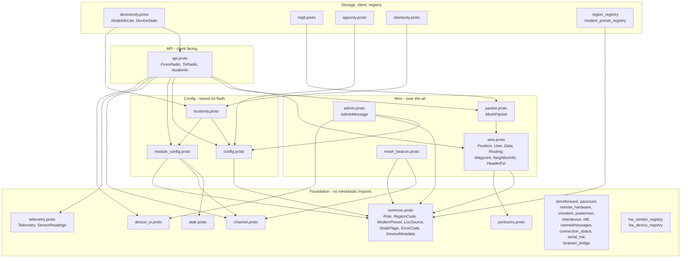

# Meshtastic 3.0 Protobufs - Developer Reference

Conventions and encodings for anyone implementing against this schema. For why the
rework happened, see [OVERVIEW.md](OVERVIEW.md).

Everything here is a hard break from 2.x. Field numbers, message shapes and encodings
all changed; nothing decodes across the boundary, and nothing is expected to.

---

## 1. File layout

Files are grouped by function. A file imports only from groups above it.



### Layering

Imports run one way: **nothing in the air layer imports the client layer.** The air
layer is everything that can appear in a `Data` payload - `common`, `portnums`,
`channel`, `wire`, `packet`, `telemetry`, `config`, `module_config`, `device_ui`,
`admin` and the module payloads: 24 files. The client layer is the eight that remain,
`api`, `localonly`, `deviceonly`, `apponly`, `clientonly` and the registries.

`admin` belongs to the air layer, which is easy to miss: remote administration means
configuration travels over the mesh, so `AdminMessage` and everything it carries is
an on-air payload rather than a phone-link one. `config`, `module_config` and
`device_ui` are air for the same reason - a remote admin exchange carries them.

Two types sit where they do because of this rule. `DeviceMetadata` is in
`common.proto` rather than `api.proto` because both layers need it - `admin` returns
it over the air, the phone API reports it - and it references nothing but `Role`.
`NodeRemoteHardwarePin` is in `module_config.proto` next to the `RemoteHardwarePin`
it wraps.

What the rule buys: a consumer that only decodes mesh traffic - an MQTT bridge, a map
backend, an analytics pipeline - can compile the air layer alone and never pull in
`FromRadio`, `ToRadio` or the storage types. It also keeps the option of splitting the
schema into two published modules later a mechanical change rather than a redesign,
without paying for that split now.

### Compact and full representations

Two representations of the same thing coexist deliberately, and which one you get
depends on which side of the phone link you are on.

**The compact form goes over the air and onto flash.** `PositionLite` and
`NodeInfoLite` are what the node stores and what the mesh carries, and `Position`'s
packed oneof arm is the same idea inside one message: a coordinate is a scaled `sint32`
on the air and a full-precision `sfixed32` on the client link.

**The full form goes to the client.** `FromRadio` hands the phone `NodeInfo` and
`Position` with every field populated, computed from the stored compact values rather
than relayed verbatim.

The two sides optimise for opposite things: airtime and flash wear on one, a decoder a
phone or a web app can read without knowing the encoding rules on the other. One type
cannot do both, which is why each pair exists. The node database follows the same rule,
stored in its compact form and served in one a client can parse directly.

### What to compile

| building | files |
|---|---|
| firmware | everything except the registries and `apponly`/`clientonly` |
| mobile / desktop app | foundation, wire, packet, config, module_config, api, admin, telemetry, atak, apponly, clientonly, mqtt, registries |
| web dashboard | common, portnums, wire, packet, telemetry, mqtt |
| MQTT bridge | common, portnums, wire, packet, mqtt |

---

## 2. Field numbering

Every message counts from 1 with no holes and no `reserved` tags. Fields a message
routinely populates sit at or below tag 15, where the protobuf key is one byte rather
than two.

There is no history in the numbering and nothing reserves a tag "in case". A field
that is removed is removed, and its number is reused by whatever comes next.

The one exception is hardware identifiers, whose numbers are externally meaningful - 
see §6.

---

## 3. Bitfields

Packed booleans are declared as an enum of hex masks beside a `uint32` field. This is
the only form protoc exports to every language, and the only one where a duplicate is
rejected by the compiler.

```proto
message Waypoint {
  enum NotifyFlags {
    NOTIFY_NONE     = 0x00;   // proto3 needs a zero first value
    NOTIFY_ON_ENTER = 0x01;
    NOTIFY_ON_EXIT  = 0x02;
  }

  uint32 notify_flags = 11;   // bitwise OR of NotifyFlags values
}
```

Rules:

- **Masks, not bit indices.** Reads naturally in every language: `flags & NOTIFY_ON_EXIT`.
- **The enum is named for its field**, in PascalCase. `notify_flags` → `NotifyFlags`.
- **Nest it in the owning message**, unless two messages must share one definition.
  `NodeFlags` in `common.proto` is shared deliberately by `NodeInfo.flags` and
  `NodeInfoLite.bitfield`, so the client-facing and stored words are interchangeable
  and cannot drift.
- **Prefix the value names.** Nested enum values share the enclosing message's
  namespace, so two enums in one message must not collide.
- **Check the nanopb `int_size`.** A mask above `0xFF` needs `int_size:16`. Getting
  this wrong silently truncates the high flags.
- **Presence bits belong here too.** A `HAS_*` mask records that a value was
  observed, which a plain `false` cannot express - see `NODE_FLAG_HAS_SNR`, which
  separates a real 0 dB reading from "never measured".

The doc comment must contain the phrase **`bitwise OR of <Enum> values`**. That is
what the tooling keys on, and it is why a `uint32` of bits that is *not* a set of
named booleans is skipped: `LoRaPresetGroup.legal_presets` indexes bits by
`ModemPreset` ordinal, `HardwareMessage.gpio_mask` by GPIO pin, and neither claims
otherwise.

CI rejects a mask that is not a single bit, two masks sharing a bit, or a value too
wide for its field. See `tools/README.md`.

---

## 4. Scaled integers, never floats

Every quantity names a fixed-point scale, so a value is always an integer.
`_CENTI` means hundredths: 23.50 °C is `2350`. A quantity needing no fraction, like
`CO2_PPM`, is a plain integer.

This is deliberate. A `float` is always four bytes on the wire - it is a fixed32 wire
type, with no varint - where a scaled value is one to three. It spends a 24-bit
mantissa on significant digits no sensor resolves. It costs software floating point on
an FPU-less MCU. And it does not round-trip: 23.45 °C is exactly `2345` as an integer
and 23.450000762939453 as a float.

Signed quantities use `sint32` (zigzag). A negative `int32` costs **ten bytes** on the
wire regardless of magnitude, which is why temperature, current, SNR and ORP are all
`sint32`.

**Match the scale to the instrument, not to a round number.** A scale finer than the
sensor resolves buys no information and multiplies every delta, which costs a byte per
sample as soon as the delta crosses 63. The four illuminance quantities are `_DECI` for
this reason: the best ambient light sensors in use resolve about 0.004 lx at maximum
gain and most resolve 1 lx, while daylight readings run to six figures. Centi-lux would
have been ten times finer than any of them, paid for on every sample of a column that
moves. Voltage in millivolts and pressure in pascals go the other way and are right for
it - those are the hardware quanta.

One field is exempt: `Nau7802Config.calibrationFactor` stays a `float`, because a
load cell calibration factor is a scale rather than a reading, and quantising a scale
quantises everything derived from it. The driver API is `float` on both sides, so a
scaled integer would add two conversions and remove none.

If a quantity ever needs finer resolution, its enum value gets a finer scale. The
encoding never varies per reading.

---

## 5. Telemetry - `SensorReadings`

One message replaces the typed environment, air quality, power and health metrics.
`DeviceMetrics` stays typed: its fields are small, always populated and never repeat.

```proto
repeated uint32 keys        = 1;  // per quantity  - the set, once
repeated sint32 values      = 2;  // per reading   - column major, delta coded
repeated sint32 time_deltas = 3;  // per sample    - twice differenced
repeated uint32 present     = 4;  // per sample    - bitmap, omitted when dense
repeated uint32 sensors     = 5;  // per quantity  - optional provenance
```

**`keys`** - `(ordinal << 8) | (constant << 7) | quantity`. The ordinal separates
several sensors reporting the same quantity on one node, and is 0 for the first, so an
ordinary key is one byte. Air temperature from three different chips is one quantity
with three ordinals, not three fields.

The `constant` bit says the column does not change across the batch, so it contributes
one entry to `values` instead of one per sample. Rainfall, lightning counts, a status
word and a wind vane in still air are all columns that otherwise spend a byte per
sample saying nothing. Setting the bit costs one byte - it pushes the key above 127,
which an ordinal of 1 or more does anyway - and saves one for every sample after the
first, so it pays from three samples up. Measured on a sixteen-sample batch of two
moving columns: one constant column alongside them is 18% smaller, three is 36%, six is
49%. A single-sample message never sets it.

**`values`** - one column per key, in `keys` order. Within a column, the first entry
is absolute and each later entry is the difference from the previous entry *in that
column*. A constant column is one entry and no deltas. Column-major because
consecutive numbers are then one sensor moving over time, and a sensor moves slowly.

```
keys        = [TEMPERATURE_C_CENTI, PRESSURE_PA]
temperature = 1582, 1548, 1514     ->  1582, -34, -34
pressure    = 98801, 98814, 98857  ->  98801, 13, 43
values      = [1582, -34, -34, 98801, 13, 43]
```

**`time_deltas`** - `Telemetry.time` is the first sample. Entry 0 is the interval to
the second sample; every later entry is the *change* in interval. A fixed cadence
emits one interval then zeros.

```
hourly samples          -> [3600, 0, 0]
last sample 40 s late   -> [3600, 0, 40]
```

Reconstruct with two running sums: `interval += entry`, `time += interval`.

**`present`** - one bitmap per sample, bit *k* set when that sample carries `keys[k]`.
It also defines **where a column's deltas step**: a column skips absent samples rather
than holding a gap, so "the previous entry" means the previous sample that carried
that quantity. Omitted entirely when every sample is dense, which is the common case.

**The sample count is `time_deltas` length plus one**, or one when `time_deltas` is
absent. Never divide `values` by `keys` to get it: that only holds for a dense batch of
non-constant columns.

**An unknown `Quantity` is skipped, not fatal.** A decoder meeting a quantity it does
not know still knows how long that column is - one entry if the key sets `constant`,
otherwise one per sample the `present` bitmap gives it - so it can step over the column
and read the rest. Nothing needs to be refused, and a node running an older enum keeps
reading the quantities it does understand.

**A single sample** - the ordinary live broadcast - has one entry per column, no
deltas, no times, no bitmap. It reads as plain values.

**Sizing.** `keys` caps at 16, `time_deltas` and `present` at 24, `values` at 64. Those
are independent to nanopb but not to the encoder: `values` is the product, so 16 columns
caps the batch at 4 samples and 24 samples caps it at 2 columns. An encoder that fills
both axes loses readings off the end of `values` without an error. Check the product.

### The same techniques outside telemetry

Three of the rules behind `SensorReadings` are not about telemetry at all, and apply
wherever the shape recurs.

**Parallel scalar columns instead of `repeated <submessage>`.** A submessage spends a
tag and a length byte on every element, plus a tag on each field inside it. Two parallel
`repeated` columns spend that framing once for the whole field and nothing per element.
It wins whenever the element count exceeds the field count, which is the usual shape for
a list of measurements or edges.

| columns | saving against one submessage per element |
|---|---|
| `NeighborInfo.neighbor_ids` / `.neighbor_snr` | 32% at 4 edges, 40% at 10, 44% at 20 |
| `DrawnShape.vertex_lat_deltas` / `.vertex_lon_deltas` | ~58 B on a 32-vertex telestration |

Columns also constrain what a message can carry: a value that is local to one node has
nowhere to sit in a pair of parallel arrays, so it stays in that node's own table.

**`fixed32` for node numbers.** Since 2.8 a NodeNum is a CRC over the node's public
key, so it is uniformly distributed over 32 bits: 15 in 16 land above 2²⁸ and cost the
full five varint bytes, against a flat four for `fixed32`. There is no low-magnitude
population to make a varint pay, and never will be. `RouteDiscovery.route` was already
right; the rest now match - `NeighborInfo.node_id`, `last_sent_by_id` and
`neighbor_ids`, `SharedContact.node_num`, `NodeRemoteHardwarePin.node_num`,
`LoRaConfig.ignore_incoming`, and the five `num` fields in the node database. The last of those is per stored node,
so it is flash rather than airtime.

`next_hop` and `relay_node` stay `uint32`: they carry the last byte of a NodeNum, not
the whole thing, so a varint is one byte where `fixed32` would be four.

**`max_count`, or nothing is packed.** Proto3 packs a `repeated` scalar by default, but
nanopb only honours that for a bounded field. Without `max_count` in the `.options` it
emits a callback instead, and a callback writes a tag per element - exactly the
per-element framing the columns exist to remove, silently, with the `.proto` still
saying `repeated sint32`. A bound also makes the message measurable: nanopb emits
`meshtastic_DrawnShape_size` at 490, which it cannot compute for a callback field. The
32-vertex pool costs no RAM, because `Route` is the larger arm of the same `oneof`.
Every `repeated` scalar in the tree carries a bound except `resend_chunks.chunks`, which
is unbounded by nature and client-facing.

---

## 6. Hardware identifiers

`hw_model` is a packed `uint32`: `(vendor_id << 8) | device_id`. Vendor 0 is the
Meshtastic community, `0x01`-`0x6F` are registered vendors with 256 device ids each,
and `0x70`-`0x7F` are private and never registered.

Names live in `hw_vendor_registry.proto` and `hw_device_registry.proto`, shipped as
data files. Firmware stores and sends only the number; clients bundle the registry and
look names up locally. **Adding a board does not touch the schema.**

Vendor ids stay within 7 bits so the packed value never exceeds `0x7FFF` and always
encodes as two varint bytes.

---

## 7. Position

One `Position` message serves both the mesh and the client link, with the coordinate
in a `oneof`:

```proto
oneof latitude_variant {
  sint32   latitude_scaled = 1;  // over the air
  sfixed32 latitude        = 2;  // client link
}
```

`latitude_scaled` is the 1e-7 degree value shifted right by `(32 - precision_bits)`,
zigzag encoded, so a coordinate costs bytes in proportion to the precision actually
shared. Masking low bits - what 2.x did - still sent four full bytes.

| precision_bits | cost | scale |
|--:|--:|---|
| 32 | 5 B (send `latitude` instead) | full |
| 21 | 3 B | ~20 m |
| 14 | 2 B | ~2.5 km |

The device sends the reconstructed full-precision `latitude` on the client link so an
app never undoes the shift. Two parallel oneofs rather than one submessage, because a
submessage would add a tag and a length byte to the form being optimised. **Use the
same form for latitude and longitude.**

---

## 8. The v3 header

The header is split by what the AEAD's additional authenticated data covers.

```
   +-----+-----+------+------+------+------+-------+   +------------+------+
   |ctrl |flags| from |  id  |  to  | chan |  ext  |   | ciphertext | path |
   |  1  |  1  |  4   |  4   | 0/4  | 0/1  |  1+n  |   |   + tag    | 0..14|
   +-----+-----+------+------+------+------+-------+   +------------+------+
   |                                               |                |
   +--------------- covered by the AAD ------------+                +-- appended,
                                                                        one byte per hop
```

Which of `to` and `chan` are present is what the profile selects. `ext` is absent when
the length byte is zero, and is a length-prefixed `HeaderExt` when it is not.

**The split is not byte-aligned, and the covered span is not wholly immutable.** `ctrl`
and `flags` each carry bits a relay rewrites. Those bits are canonicalised to zero
before the AAD is computed, so the rest of both bytes stays authenticated; the same
construction IPsec AH uses on the IP header's TTL and ToS. Everything else inside the
covered span is byte-for-byte immutable in flight.

| field | written by | in the AAD |
|---|---|---|
| `ver`, `profile` (`ctrl`) | originator | yes |
| `hop_limit` (`ctrl`) | every relay | no, zeroed |
| `hop_start`, `want_ack`, `ext`, `path` (`flags`) | originator | yes |
| `via_mqtt` (`flags`) | a gateway | no, zeroed |
| `from`, `id`, `to`, `chan`, the ext block | originator | yes |
| `relay`, `next_hop` | every relay | no |
| path bytes | every relay | no |

`EXT` has no `flags` byte and no mutable core fields, so its AAD is `ctrl` with the hop
bits zeroed plus its length byte and block: the whole header.

### The two always-present bytes

`ctrl` is the one byte whose meaning can never change, because it is what says how to
read everything after it.

```
     7     6   5  4   3     2     1  0
   +---+ +---------------+ +---+ +-------+
   |ver| |   hop_limit   | |rsv| |profile|
   +---+ +---------------+ +---+ +-------+
     |           |           |       |
     |           |           |       +-- selects the core layout, 4 values
     |           |           +-- reserved, must be 0
     |           +-- 0..15, MUTABLE, canonicalised to zero in the AAD
     +-- 0 = v3
```

**The version field is one bit.** A firmware build carries at most two wire formats at
once, which is what a gradual migration needs and the most that is maintainable. The
bit distinguishes the format being migrated from the one being migrated to; a completed
conversion frees it to flip back for the next. A break that cannot be done gradually
changes the PHY sync word, which is a different mechanism at a lower layer.

`flags` is present on profiles 1 to 3.

```
     7   6  5   4      3     2      1     0
   +---------------+ +---+ +----+ +---+ +----+
   |   hop_start   | |ack| |mqtt| |ext| |path|
   +---------------+ +---+ +----+ +---+ +----+
           |           |     |      |     |
           |           |     |      |     +-- a path tail follows the ciphertext
           |           |     |      +-- an ext block is present
           |           |     +-- via_mqtt, MUTABLE, gateway-set, not in the AAD
           |           +-- want_ack
           +-- 0..15, the budget the originator launched with
```

Both bytes are fully assigned. `hop_start` matches `hop_limit` at four bits, so a
packet can be launched with up to fifteen hops of budget.

### Profiles

`CORE_LEN` is a complete 4-entry table. The profile field is attacker-controlled, so a
partial `switch` with a fallthrough is a vulnerability.

| # | profile | fields | bytes |
|--:|---|---|--:|
| 0 | `MINI` | `ctrl nonce4` | 5 |
| 1 | `BCAST` | `ctrl flags from4 id4 chan relay` | 12 |
| 2 | `UCAST` | `ctrl flags from4 id4 to4 relay next_hop` | 16 |
| 3 | `EXT` **(tbd)** | `ctrl len block` | 2 + len |
| | today's fixed `PacketHeader` | | 16 |

```
profile 0  MINI   no addressing                 5 bytes
     0     1     2     3     4
  +-----+-----------------------+
  | ctrl|       nonce (4)       |
  +-----+-----------------------+

profile 1  BCAST  addressed to everyone        12 bytes
     0     1     2     3     4     5     6     7     8     9     10    11
  +-----+-----+-----------------------+-----------------------+-----+-----+
  | ctrl|flags|        from (4)       |         id (4)        | chan|relay|
  +-----+-----+-----------------------+-----------------------+-----+-----+

profile 2  UCAST  addressed to one, PKI only   16 bytes
     0     1     2     3     4     5     6     7     8     9     10    11    12    13    14    15
  +-----+-----+-----------------------+-----------------------+-----------------------+-----+-----+
  | ctrl|flags|        from (4)       |         id (4)        |         to (4)        |relay| nhop|
  +-----+-----+-----------------------+-----------------------+-----------------------+-----+-----+

profile 3  EXT    length-prefixed core         2 + len bytes
     0     1     2                       1+len
  +-----+-----+------- ... -------------+
  | ctrl| len |    protobuf, len bytes  |
  +-----+-----+------- ... -------------+
```

`nhop` is `next_hop`. Both it and `relay` carry the last byte of a NodeNum rather than
the whole thing: `relay` is the node this frame was last transmitted by, `next_hop` the
node it is meant for next.

Three profiles ship. `EXT` is the escape hatch for a core that outgrows a fixed table:
reserved, not implemented, and its `CORE_LEN` entry maps to a drop until it is.

**`EXT` uses the extension block's own mechanism as its core.** A length byte, then that
many bytes of an encoded protobuf message. `ctrl` is present because the profile has to
be read from somewhere, so a receiver always has a version, a profile and a length
before it has anything variable. The message that goes in the block is deliberately not
defined here - fixing the framing forever is what makes the hatch an escape hatch, and
fixing the content would defeat it.

So `CORE_LEN` holds a constant for profiles 0 to 2 and a rule for profile 3: the core is
`2 + frame[1]` bytes, bounds-checked against the frame before anything reads past it.
That keeps the relay fast path what it was - no loop over attacker-controlled bytes,
one length and one comparison.

**The block is immutable, so an `EXT` frame is never relayed.** Relaying means writing
`relay` and appending to the path, and in this profile those live inside a block that
cannot be re-encoded in flight without dropping the unknown fields it exists to carry.
`hop_limit` is therefore zero on an `EXT` frame, and a receiver drops one that arrives
with it set. `EXT` reaches nodes in direct radio range of the sender.

**Everything except `hop_limit` is signed.** With no `flags` byte and no mutable core
fields, the AAD over an `EXT` frame is `ctrl` with the hop bits canonicalised to zero,
the length byte, and the whole block - which is the entire header. It is the only
profile where that is true.

Two profile bits rather than three, because four layouts is the useful space: no
addressing, addressed to everyone, addressed to one, and an escape hatch. A broadcast
variant without `relay` would save a byte and cost a code path and a table entry, and
`relay` is what `NextHopRouter` learns routes from. The third bit is reserved in
`ctrl`.

**The expandable header is smaller than the fixed one on the dominant traffic class.**
A broadcast `to` is four bytes of `0xFFFFFFFF` today, and the broadcast profiles encode
it in zero bits, so expandability pays for itself before a single extension is added.

**Unicast carries no channel hash.** A PSK is a channel key, so PSK traffic is
inherently broadcast, and a DM is exclusively PKI - signed but unencrypted in HAM mode,
encrypted otherwise. That is what buys back the byte `ctrl` costs and lands `UCAST`
at exactly today's 16.

Four sizing rules fix the rest of the layout:

- **The `MINI` nonce is four bytes.** It collides at around 2^16 packets on a
  private net, above what a `MINI` deployment sends and below the point where a fifth
  byte is worth spending.
- **The tail records one-byte NodeNum suffixes**, matching `relay`, not full NodeNums
  at four bytes each.
- **`channel` is a full byte** on the broadcast profiles. A six-bit hash frees two bits
  in the core and pays for them with extra decode attempts on every received packet.
- **There is no critical extension bit.** A field that tells a relay to drop a packet
  it does not understand contradicts the one property the extension block guarantees.

### Hop accounting

`hop_start` is authenticated and `hop_limit` is not, so **their difference is not
authenticated.** `hops_away` is a hint. It must never be an authorisation input, and
anything that decides whether to forward, to trust a neighbour, or to suppress a
duplicate needs evidence that is not a subtraction between a protected and an
unprotected field.

Two rules follow, both free on receive:

- **`hop_limit > hop_start` is structurally impossible. Drop the frame.** One
  comparison, and it removes budget inflation entirely: an attacker who can rewrite
  `hop_limit` without breaking the tag is left able only to decrease it, which is
  equivalent to dropping the packet and gains nothing.
- **`hop_start == hop_limit` is not proof of origination.** It is a cheap hint that a
  packet is an originator retransmission, and forging it costs an attacker four bits
  outside the AAD. A receiver that acts on it - reprocessing a packet it has already
  seen, and rebroadcasting it - must first confirm the path tail is empty. The path is
  one byte per hop and is better evidence than the subtraction.

Neither `MINI` nor `EXT` carries a `flags` byte, so neither has a `hop_start` and the
first rule cannot be evaluated on them. Both carry `hop_limit` zero, are never relayed,
and a receiver drops one that arrives with `hop_limit` set - which is the same check the
first rule performs, reached by a different route.

### The path tail

A frame records the route it took as `from`, then the path tail, then `relay`:

```
   from  ->  path[0]  ->  path[1]  ->  ...  ->  relay
   origin     hop 1        hop 2                last hop
```

`relay` is always the node the frame was last transmitted by, whether or not a tail is
present, so anything that only wants the previous hop reads one byte at a fixed core
offset and never looks at the tail. The tail is optional and `flags.path` says whether
a frame carries one; without it the intermediate hops are simply not recorded.

**The tail's length is not carried.** Its two ends are already in the core, so it holds
the hops between them - one fewer byte than the number of hops taken:

```
   path length = max(0, (hop_start - hop_limit) - 1)
   payload_end = frame_len - path length      (path present, else frame_len)
```

**Relaying is two byte-writes and no memmove.** A relay appends the frame's current
`relay` value to the tail, then writes its own suffix into `relay`. The first relay
appends nothing, because the value it would append is the originator, which `from`
already gives.

**On a frame that carries a tail, `hop_limit` is tamper-evident without being in the
AAD.** Altering it moves the payload boundary, which moves the ciphertext and tag, which
fails verification in either direction. That is no new capability for an attacker, who
could always corrupt a ciphertext byte, but it puts budget inflation out of reach.

Two gaps in that, both of which the receive-side rules above cover. The property does
not hold at all when `flags.path` is clear, since nothing then ties `hop_limit` to the
frame geometry. And because the length floors at zero, moving a frame between zero and
one hops taken leaves the boundary where it was - which is exactly the edit that makes a
relayed frame read as an originator retransmission, and why that inference needs its own
check rather than resting on the geometry.

**The invariant a relay preserves is `path length == max(0, hops taken - 1)`.**
Appending and decrementing together preserves it, and so does doing neither, at the
cost of a tail that omits that hop. Decrementing without appending, or setting
`hop_limit` to zero in one step, breaks the frame for every node downstream.

### The extension block

`ext` is a length byte followed by that many bytes of an encoded `HeaderExt`.

```
   ext_len (1) || <ext_len bytes of encoded HeaderExt>
```

It is not a bespoke TLV. It is an ordinary protobuf message in `wire.proto`, encoded
with the nanopb already in the tree:

```proto
message HeaderExt {
  /* Fragmentation state, packed as msg_id(8) | index(4) | total(4). */
  uint32 fragment = 1;
}
```

Being real protobuf is the whole point. Unknown fields skip by protobuf's own rules,
so a relay carrying a field its build has never heard of needs no new code. Third-party
MQTT consumers decode it with generated code in every language. Field numbering and
deprecation work as they do everywhere else.

The block carries no route. A prescriptive path and the descriptive one in the tail
are the same list in the same encoding, and the tail already records what a route was,
which is what a reply needs in order to steer itself.

**Tags 1 to 15 are the hop-by-hop budget.** They cost a one-byte key and are the only
ones a relay may ever read; an unknown one is forwarded verbatim and never acted on.
Tags 16 and above cost two bytes and are end-to-end, so a relay has no business looking
at them at all. `fragment` sits in the cheap range even though a relay never reads
it, because a hop-by-hop field added later will need the space.

What it costs, including the length byte:

| ext block content | bytes |
|---|--:|
| none | 0 |
| fragmentation state | 4 |
| eight future bools as one bitfield | 4 |
| one future `uint16` field | 5 |
| fragment plus one future field | 8 |

A future field a relay carries blind costs **five bytes on the packets that carry it
and nothing on the rest**. Growing the fixed header by one field instead costs every
packet forever. That asymmetry is the argument for the whole design.

**The relay fast path** is a version check, a table lookup and one bounds check. No
loop over attacker-controlled bytes at any profile, and the block is parsed only in
endpoints, after AEAD verification.

**XEdDSA signs the same set the AAD covers**, canonicalised the same way, so a HAM
mode frame and an encrypted one protect identical bytes.

`from` and `id` are in the nonce derivation and must not be narrowed. `to` is not,
which is what lets the broadcast profiles elide it.

**The invariant that makes it work: never decode and re-encode `HeaderExt` in
transit.** nanopb drops unknown fields on decode, so a re-encode silently strips
exactly the forward compatibility the block exists to provide. Enforce it with a test
that round-trips an unknown high tag through the relay path and asserts the bytes come
out identical - not with a comment.

`MeshPacket.header_ext` carries the encoded block through to the phone API and MQTT so
a packet's extensions survive intact, including fields the local build does not know.

**Fragmentation** is `HeaderExt.fragment`, packed `msg_id(8) | index(3) | total(3)`.
Endpoint-only; relays treat fragments as independent packets. `total` travels on every
fragment so a receiver that gets fragment 3 first can size its buffer. There is no new
ARQ - each fragment is an ordinary packet, so `want_ack` already covers it.

**Eight fragments is the ceiling**, about 1.8 kB, with `total` holding the count minus
one. The field is three bits per counter and not four because the fourth is not free
in either direction: fourteen bits is a two-byte varint where fifteen is a three-byte
one, so the wider counters cost a byte on every fragmented frame, and they buy a range
no mesh can deliver.

| fragments | bytes | arrives whole at 90% | at 80% |
|--:|--:|--:|--:|
| 2 | 466 | 81% | 64% |
| 4 | 932 | 66% | 41% |
| 8 | 1,864 | 43% | 17% |
| 16 | 3,728 | 19% | 3% |

Delivery probability binds long before the field width does, which is also why
fragmentation ships off by default and opts in per portnum. The byte overhead is ~12%;
the arrival odds are what kill you.

---

## 9. Tooling

`tools/gen_bitfield_accessors.py` reads the descriptor set `buf build -o` emits. It
validates every mask and generates header-only C++ accessors. CI runs the validation
half on every pull request; header emission belongs downstream in firmware, which
vendors this repo as a submodule. See `tools/README.md`.

`tools/schema_lint.py` checks four of the rules stated above that nothing else can
see: no plain `int32`/`int64` (§4), no `float`/`double` (§4), a `max_count` on every
`repeated` scalar (§5), and no air-layer file importing the client layer (§1). A
violation of any of them builds and lints clean, which is why each has been introduced
at least once. It runs in the same CI job as the mask validation, and its two
exemptions carry their reasons in the source.

`tools/wire_size.py` computes what the 3.0 encoding costs against the 2.x shape for the
messages whose encoding changed. It is a documentation generator, not a test: the field
numbers in it are written down rather than read from the schema, so it cannot notice a
regression. `schema_lint.py` is the one that can.

`buf breaking` will fail against the registry baseline. That is the intended 3.0
break, not a regression.

---

## 10. Known gaps

Open work, and decisions deliberately not yet made.

**Deferred, needs data:**

- **Tag ordering in the large messages.** The assignment of tags 1-15 rests on
  judgement rather than on measured traffic. It costs most in `AdminMessage`, where
  the whole config write path - `set_owner`, `set_channel`, `set_config`,
  `set_module_config`, `begin_edit_settings`, `commit_edit_settings` - sits above 15
  and pays a two-byte key, while the read path sits below it. `Position` and
  `MeshPacket` were ordered the same way. A portnum-weighted airtime histogram from a
  live mesh would settle all three, and nothing should move until one exists.

**Deferred by scope:**

- **Header profile 3.** `EXT`'s framing is fixed in §8 and the message that goes in
  its block is not defined. Its `CORE_LEN` entry maps to a drop until one exists.

**Stated but not built:**

- **The "never re-encode `HeaderExt` in transit" test.** §8 requires it as a test
  rather than a comment, because nanopb drops unknown fields on decode and a re-encode
  silently strips exactly the forward compatibility the block exists to provide. Round
  trip an unknown high tag through the relay path and assert the bytes are identical.
- **Fragmentation off by default, opt-in per portnum.** §8 states the policy; nothing
  implements the gate.

**Firmware work the schema assumes:**

- **`DeviceState` is written on configuration changes only.** Nothing in the message
  changes per packet, so a deep sleep is not a reason to rewrite it. Firmware that
  saves it on every sleep pays the flash wear for nothing.
- **`RemoteHardware` authorisation.** `RemoteHardwareConfig.authorized_key` exists;
  the module must reject a `HardwareMessage` that did not arrive as a PKI direct
  message from a listed key, the way `AdminMessage` already does. Until that lands the
  module stays off by default, because a channel key is shared by everyone on the
  channel and so authorises everyone on it.
- **Hop exhaustion has to stop rebroadcasting rather than zero the budget.**
  `shouldExhaustHops` in the traffic management module sets `hop_limit = 0` in one
  step while appending a single path byte, which breaks
  `path length == hop_start - hop_limit` and makes the frame undecodable downstream.
  Dropping the packet instead achieves the same end - the packet stops here - without a
  wire inconsistency. The favourite router-to-router path that skips the decrement is
  fine as it stands, since it appends nothing either.
- **Event mode must stop rewriting `hop_start`.** `capEventRelayHops` in
  `NextHopRouter.cpp` clamps `hop_limit` at a relay and reduces `hop_start` by the same
  amount to keep `hops_away` accurate downstream. `hop_start` is in the AAD, so a relay
  cannot change it without invalidating the tag. The clamp on `hop_limit` stays; what
  goes is the compensating edit, which means `hops_away` over-reports past an
  event-mode relay. That is a display and heuristic inaccuracy in one build flavour,
  against an authenticated statement of the originator's budget everywhere - which is
  what makes the `hop_limit > hop_start` check mean anything.
- **Sixteen channels.** `MAX_NUM_CHANNELS` is not a firmware constant: `mesh-pb-constants.h`
  derives it from `sizeof(ChannelFile.channels) / sizeof(channels[0])`, so the count is set
  by `*ChannelFile.channels max_count` in `deviceonly.options` and by nothing else. It is
  16, with `ChannelSet.settings` matched to it. `ChannelFile` costs 1096 bytes of RAM at
  16 against 552 at 8. `Channels.cpp` carries a `static_assert(MAX_NUM_CHANNELS == 8)`
  guarding a `userPrefs` switch that covers indices 0 to 7; that switch has to grow before
  the firmware will build.
- **Channel storage should be allocated dynamically.** `Channels.cpp` sets
  `channels_count = MAX_NUM_CHANNELS` and `NodeDB.cpp` validates that it equals the
  maximum, so the table is always full: a node using two channels holds sixteen records
  and pays 1096 bytes for them. A node should hold the channels it has. Note that this
  is not purely a firmware change - `MAX_NUM_CHANNELS` is derived from
  `sizeof(ChannelFile.channels)`, so a pointer-based field removes the thing that
  defines it, and the limit has to be declared somewhere rather than inferred.
  16 is the cap chosen for the fixed array; it is not a reason to keep one.
- **The channel role enum is gone.** Index 0 is the primary channel and an absent
  `settings` disables one, so firmware and clients that switched on `Channel.role`
  need to read position and presence instead.

**Documentation:**

- **`ChannelSettings` under-documents itself.** It does not say how admin messages are
  secured, and its `id` comment refers to a "Well Known Channels" table that does not
  exist.
