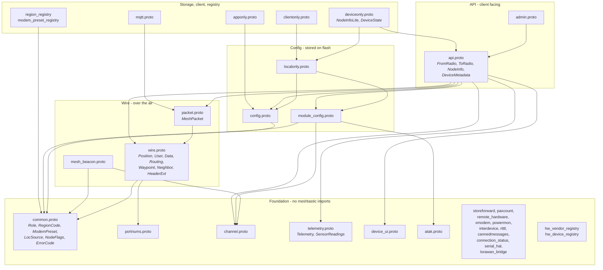

# Meshtastic 3.0 Protobufs — Developer Reference

Conventions and encodings for anyone implementing against this schema. For why the
rework happened, see [OVERVIEW.md](OVERVIEW.md).

Everything here is a hard break from 2.x. Field numbers, message shapes and encodings
all changed; nothing decodes across the boundary, and nothing is expected to.

---

## 1. File layout

Files are grouped by function. A file imports only from groups above it.



### What to compile

| building | files |
|---|---|
| firmware | everything except the registries and `apponly`/`clientonly` |
| mobile / desktop app | foundation, wire, packet, config, module_config, api, admin, telemetry, atak, apponly, clientonly, mqtt, registries |
| web dashboard | common, portnums, wire, packet, telemetry, mqtt |
| MQTT bridge | common, portnums, wire, packet, mqtt |

---

## 2. Field numbering

Every message counts from 1 with no holes and no `reserved` tags. Fields a message
routinely populates sit at or below tag 15, where the protobuf key is one byte rather
than two.

There is no history in the numbering and nothing reserves a tag "in case". A field
that is removed is removed, and its number is reused by whatever comes next.

The one exception is hardware identifiers, whose numbers are externally meaningful —
see §6.

---

## 3. Bitfields

Packed booleans are declared as an enum of hex masks beside a `uint32` field. This is
the only form protoc exports to every language, and the only one where a duplicate is
rejected by the compiler.

```proto
message Waypoint {
  enum NotifyFlags {
    NOTIFY_NONE     = 0x00;   // proto3 needs a zero first value
    NOTIFY_ON_ENTER = 0x01;
    NOTIFY_ON_EXIT  = 0x02;
  }

  uint32 notify_flags = 11;   // bitwise OR of NotifyFlags values
}
```

Rules:

- **Masks, not bit indices.** Reads naturally in every language: `flags & NOTIFY_ON_EXIT`.
- **The enum is named for its field**, in PascalCase. `notify_flags` → `NotifyFlags`.
- **Nest it in the owning message**, unless two messages must share one definition.
  `NodeFlags` in `common.proto` is shared deliberately by `NodeInfo.flags` and
  `NodeInfoLite.bitfield`, so the client-facing and stored words are interchangeable
  and cannot drift.
- **Prefix the value names.** Nested enum values share the enclosing message's
  namespace, so two enums in one message must not collide.
- **Check the nanopb `int_size`.** A mask above `0xFF` needs `int_size:16`. Getting
  this wrong silently truncates the high flags.
- **Presence bits belong here too.** A `HAS_*` mask records that a value was
  observed, which a plain `false` cannot express — see `NODE_FLAG_HAS_SNR`, which
  separates a real 0 dB reading from "never measured".

The doc comment must contain the phrase **`bitwise OR of <Enum> values`**. That is
what the tooling keys on, and it is why a `uint32` of bits that is *not* a set of
named booleans is skipped: `LoRaPresetGroup.legal_presets` indexes bits by
`ModemPreset` ordinal, `HardwareMessage.gpio_mask` by GPIO pin, and neither claims
otherwise.

CI rejects a mask that is not a single bit, two masks sharing a bit, or a value too
wide for its field. See `tools/README.md`.

---

## 4. Scaled integers, never floats

Every quantity names a fixed-point scale, so a value is always an integer.
`_CENTI` means hundredths: 23.50 °C is `2350`. A quantity needing no fraction, like
`CO2_PPM`, is a plain integer.

This is deliberate. A `float` is always four bytes on the wire — it is a fixed32 wire
type, with no varint — where a scaled value is one to three. It spends a 24-bit
mantissa on significant digits no sensor resolves. It costs software floating point on
an FPU-less MCU. And it does not round-trip: 23.45 °C is exactly `2345` as an integer
and 23.450000762939453 as a float.

Signed quantities use `sint32` (zigzag). A negative `int32` costs **ten bytes** on the
wire regardless of magnitude, which is why temperature, current, SNR and ORP are all
`sint32`.

If a quantity ever needs finer resolution, its enum value gets a finer scale. The
encoding never varies per reading.

---

## 5. Telemetry — `SensorReadings`

One message replaces the typed environment, air quality, power and health metrics.
`DeviceMetrics` stays typed: its fields are small, always populated and never repeat.

```proto
repeated uint32 keys        = 1;  // per quantity  - the set, once
repeated sint32 values      = 2;  // per reading   - column major, delta coded
repeated sint32 time_deltas = 3;  // per sample    - twice differenced
repeated uint32 present     = 4;  // per sample    - bitmap, omitted when dense
repeated uint32 sensors     = 5;  // per quantity  - optional provenance
```

**`keys`** — `(ordinal << 7) | quantity`. The ordinal separates several sensors
reporting the same quantity on one node, and is 0 for the first, so an ordinary key is
one byte. Air temperature from three different chips is one quantity with three
ordinals, not three fields.

**`values`** — one column per key, in `keys` order. Within a column, the first entry
is absolute and each later entry is the difference from the previous entry *in that
column*. Column-major because consecutive numbers are then one sensor moving over
time, and a sensor moves slowly.

```
keys        = [TEMPERATURE_C_CENTI, PRESSURE_PA]
temperature = 1582, 1548, 1514     ->  1582, -34, -34
pressure    = 98801, 98814, 98857  ->  98801, 13, 43
values      = [1582, -34, -34, 98801, 13, 43]
```

**`time_deltas`** — `Telemetry.time` is the first sample. Entry 0 is the interval to
the second sample; every later entry is the *change* in interval. A fixed cadence
emits one interval then zeros.

```
hourly samples          -> [3600, 0, 0]
last sample 40 s late   -> [3600, 0, 40]
```

Reconstruct with two running sums: `interval += entry`, `time += interval`.

**`present`** — one bitmap per sample, bit *k* set when that sample carries `keys[k]`.
It also defines **where a column's deltas step**: a column skips absent samples rather
than holding a gap, so "the previous entry" means the previous sample that carried
that quantity. Omitted entirely when every sample is dense, which is the common case.

**A single sample** — the ordinary live broadcast — has one entry per column, no
deltas, no times, no bitmap. It reads as plain values.

---

## 6. Hardware identifiers

`hw_model` is a packed `uint32`: `(vendor_id << 8) | device_id`. Vendor 0 is the
Meshtastic community, `0x01`–`0x6F` are registered vendors with 256 device ids each,
and `0x70`–`0x7F` are private and never registered.

Names live in `hw_vendor_registry.proto` and `hw_device_registry.proto`, shipped as
data files. Firmware stores and sends only the number; clients bundle the registry and
look names up locally. **Adding a board does not touch the schema.**

Vendor ids stay within 7 bits so the packed value never exceeds `0x7FFF` and always
encodes as two varint bytes.

---

## 7. Position

One `Position` message serves both the mesh and the client link, with the coordinate
in a `oneof`:

```proto
oneof latitude_variant {
  sint32   latitude_scaled = 1;  // over the air
  sfixed32 latitude        = 2;  // client link
}
```

`latitude_scaled` is the 1e-7 degree value shifted right by `(32 - precision_bits)`,
zigzag encoded, so a coordinate costs bytes in proportion to the precision actually
shared. Masking low bits — what 2.x did — still sent four full bytes.

| precision_bits | cost | scale |
|--:|--:|---|
| 32 | 5 B (send `latitude` instead) | full |
| 21 | 3 B | ~20 m |
| 14 | 2 B | ~2.5 km |

The device sends the reconstructed full-precision `latitude` on the client link so an
app never undoes the shift. Two parallel oneofs rather than one submessage, because a
submessage would add a tag and a length byte to the form being optimised. **Use the
same form for latitude and longitude.**

---

## 8. The v3 header

Three regions, split by who may write to them.

```
        immutable (in AAD)            mutable
   +---------------------------+   +-----------+
 | ctrl |flags| from | id | to | ch | ext |   | ciphertext |  path
 |  1   |  1  |  4   |  4 |0/4 | 1  | 1+n |   |   + tag    | 0..7
   ^                            ^
   +-- version, profile,        +-- protobuf HeaderExt, opaque to relays
       hop limit (mutable)
```

**Profiles.** `CORE_LEN` must be a complete 8-entry table with reserved profiles
mapping to a drop — the profile field is attacker-controlled, so a partial `switch`
with a fallthrough is a vulnerability.

| # | profile | bytes |
|--:|---|--:|
| 0 | minimal — `ctrl` + nonce | 5 |
| 2 | broadcast | 12 |
| 3 | unicast | 16 |

Unicast carries no channel hash: a PSK is a channel key, so PSK traffic is inherently
broadcast, and a DM is exclusively PKI — signed but unencrypted in HAM mode, encrypted
otherwise.

**The relay fast path** is a version check, a table lookup and one bounds check. No
loop over attacker-controlled bytes, and the TLV parse happens only in endpoints after
AEAD verification.

**AAD** covers `ctrl` and `flags` with the mutable bits zeroed, plus `from`, `id`,
`to`, `channel` and the whole extension block. Excluded because relays rewrite them:
`hop_limit`, `via_mqtt`, `next_hop`, `relay`, `path_len`, path bytes. XEdDSA signs the
same set. `from` and `id` stay in the nonce derivation and must not be narrowed; `to`
is not, which is what lets the broadcast profiles elide it.

**The invariant that makes it work: never decode and re-encode `HeaderExt` in
transit.** nanopb drops unknown fields on decode, so a re-encode silently strips
exactly the forward compatibility the block exists to provide. Enforce it with a test
that round-trips an unknown high tag through the relay path and asserts the bytes come
out identical — not with a comment.

`MeshPacket.header_ext` carries the encoded block through to the phone API and MQTT so
a packet's extensions survive intact, including fields the local build does not know.

**Fragmentation** is `HeaderExt.fragment`, packed `msg_id(8) | index(4) | total(4)`.
Endpoint-only; relays treat fragments as independent packets. `total` travels on every
fragment so a receiver that gets fragment 3 first can size its buffer. There is no new
ARQ — each fragment is an ordinary packet, so `want_ack` already covers it. Ship it
off by default and opt in per portnum: the byte overhead is ~12%, but the delivery
probability is what kills you (a 7-fragment message is 48% likely to arrive whole at
90% per-packet delivery).

---

## 9. Tooling

`tools/gen_bitfield_accessors.py` reads the descriptor set `buf build -o` emits. It
validates every mask and generates header-only C++ accessors. CI runs the validation
half on every pull request; header emission belongs downstream in firmware, which
vendors this repo as a submodule. See `tools/README.md`.

`buf breaking` will fail against the registry baseline. That is the intended 3.0
break, not a regression.

---

## 10. Known gaps

Carried over from the 2.x notes and still open:

- **`DeviceState` flash wear.** The whole blob is rewritten on every deep sleep. An
  append-only log for `receive_queue` plus a preferences store for the rest would cut
  write amplification substantially.
- **`RemoteHardware` authorisation.** `RemoteHardwareConfig.enabled` defaults false,
  but the original code path may bypass it. Any node on the channel can otherwise
  read and write GPIO on a remote node. Verify enforcement in firmware.
- **Channel documentation.** `ChannelSettings` is the primary reference for client
  developers and still does not explain primary versus secondary roles, how admin
  messages are secured, or the well-known channel ids its comments refer to.
- **`PositionLite` and `NodeInfoLite`** remain separate from `Position` and
  `NodeInfo`. Collapsing each pair is the same "one canonical representation"
  argument that retired the legacy nodedb types, and has not been settled.
- **Corpus-driven field ordering.** Which fields deserve tags 1–15 in
  `EnvironmentMetrics`-style messages was decided on judgement. A portnum-weighted
  airtime histogram from a live mesh would settle it properly.
