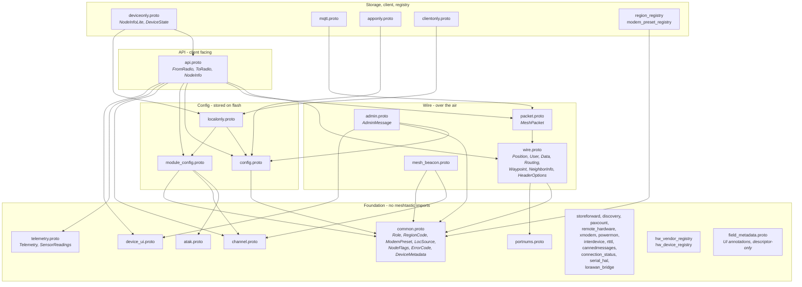

# Meshtastic 3.0 Protobufs - Developer Reference

Conventions and encodings for anyone implementing against this schema. For why the
rework happened, see [OVERVIEW.md](OVERVIEW.md).

This document is the whole schema. Field numbers, message shapes, encodings and bounds are
as stated here.

---

## 1. File layout

Files are grouped by function. A file imports only from groups above it.


```mermaid
graph TD
    subgraph Foundation["Foundation - no meshtastic imports"]
        common[common.proto<br/><i>Role, RegionCode, ModemPreset, LocSource,<br/>NodeFlags, ErrorCode, DeviceMetadata</i>]
        portnums[portnums.proto]
        channel[channel.proto]
        telemetry[telemetry.proto<br/><i>Telemetry, SensorReadings</i>]
        deviceui[device_ui.proto]
        atak[atak.proto]
        modules[storeforward, discovery, paxcount,<br/>remote_hardware, xmodem, powermon,<br/>interdevice, rtttl, cannedmessages,<br/>connection_status, serial_hal,<br/>lorawan_bridge]
        registries[hw_vendor_registry<br/>hw_device_registry]
        fieldmeta[field_metadata.proto<br/><i>UI annotations, descriptor-only</i>]
    end

    subgraph Wire["Wire - over the air"]
        wire[wire.proto<br/><i>Position, User, Data, Routing,<br/>Waypoint, NeighborInfo, HeaderOptions</i>]
        packet[packet.proto<br/><i>MeshPacket</i>]
        beacon[mesh_beacon.proto]
        admin[admin.proto<br/><i>AdminMessage</i>]
    end

    subgraph Config["Config - stored on flash"]
        config[config.proto]
        moduleconfig[module_config.proto]
        localonly[localonly.proto]
    end

    subgraph Api["API - client facing"]
        api[api.proto<br/><i>FromRadio, ToRadio, NodeInfo</i>]
    end

    subgraph Other["Storage, client, registry"]
        deviceonly[deviceonly.proto<br/><i>NodeInfoLite, DeviceState</i>]
        mqtt[mqtt.proto]
        apponly[apponly.proto]
        clientonly[clientonly.proto]
        regreg[region_registry<br/>modem_preset_registry]
    end

    wire --> common
    wire --> portnums
    packet --> wire
    beacon --> channel
    beacon --> common
    config --> common
    moduleconfig --> atak
    moduleconfig --> channel
    moduleconfig --> common
    localonly --> config
    localonly --> moduleconfig
    regreg --> common
    api --> wire
    api --> packet
    api --> config
    api --> moduleconfig
    api --> channel
    api --> telemetry
    api --> deviceui
    admin --> config
    admin --> common
    admin --> deviceui
    deviceonly --> api
    deviceonly --> localonly
    mqtt --> packet
    apponly --> config
    clientonly --> localonly
```

The graph shows each file's highest-layer imports. A file that imports a higher layer
also imports the foundation files it needs, and those edges are elided to keep the shape
readable: `admin` and `deviceonly` also import `wire` and `channel`, `deviceonly` also
imports `common` and `telemetry`, `api` and `mqtt` also import `common`, `apponly` also
imports `channel`, and `clientonly` also imports `wire`. `field_metadata` has no edge drawn
at all: any file may import it to annotate a field, and four of them do. What the graph is
load-bearing for is the direction of every edge, which `schema_lint`'s `layering` rule
enforces.

### Layering

Imports run one way: **nothing in the air layer imports the client layer.** The air
layer is everything that can appear in a `Data` payload - `common`, `portnums`,
`channel`, `wire`, `packet`, `telemetry`, `config`, `module_config`, `device_ui`,
`admin` and the module payloads: 24 files. The client layer is the eight that remain,
`api`, `localonly`, `deviceonly`, `apponly`, `clientonly` and the registries.

`admin` belongs to the air layer, which is easy to miss: remote administration means
configuration travels over the mesh, so `AdminMessage` and everything it carries is
an on-air payload rather than a phone-link one. `config`, `module_config` and
`device_ui` are air for the same reason - a remote admin exchange carries them.

Two types sit where they do because of this rule. `DeviceMetadata` is in
`common.proto` rather than `api.proto` because both layers need it - `admin` returns
it over the air, the phone API reports it - and it references nothing but `Role`.
`NodeRemoteHardwarePin` is in `module_config.proto` next to the `RemoteHardwarePin`
it wraps.

What the rule buys: a consumer that only decodes mesh traffic - an MQTT bridge, a map
backend, an analytics pipeline - can compile the air layer alone and never pull in
`FromRadio`, `ToRadio` or the storage types. It also keeps the option of splitting the
schema into two published modules later a mechanical change rather than a redesign,
without paying for that split now.

### Compact and full representations

Two representations of the same thing coexist deliberately, and which one you get
depends on which side of the phone link you are on.

**The compact form goes over the air and onto flash.** `PositionLite` and
`NodeInfoLite` are what the node stores and what the mesh carries, and `Position`'s
packed oneof arm is the same idea inside one message: a coordinate is a scaled `sint32`
on the air and a full-precision `sfixed32` on the client link.

**The full form goes to the client.** `FromRadio` hands the phone `NodeInfo` and
`Position` with every field populated, computed from the stored compact values rather
than relayed verbatim.

The two sides optimise for opposite things: airtime and flash wear on one, a decoder a
phone or a web app can read without knowing the encoding rules on the other. One type
cannot do both, which is why each pair exists. The node database follows the same rule,
stored in its compact form and served in one a client can parse directly.

**A fact is stored once and may be sent from anywhere.** Duplication is judged by what
each copy is used for, not by its type. A message written to flash or kept by a client is
storage; one that travels over the air, the phone link, MQTT or an admin request is
processing, and is filled from the stored copy when it is sent. Two stored copies of one
fact are a duplicate, because they drift and one of them has to lose. Copies in
processing messages are not. The same type is often both: `User` is stored as
`DeviceState.owner` and sent in a `NODEINFO_APP` packet, inside `NodeInfo`, in
`set_owner` and in `SharedContact`, so the question is asked of each use. `DeviceMetadata`
is never stored by the node, and the node's public key has its source in `SecurityConfig`
although `User` sends it. The one deliberate second store is the node's own entry in the
node database, a recovery copy of the owner that survives the loss of `DeviceState`.

### What to compile

| building | files |
|---|---|
| firmware | everything except the registries and `apponly`/`clientonly` |
| mobile / desktop app | foundation, wire, packet, config, module_config, api, admin, telemetry, atak, apponly, clientonly, mqtt, registries |
| web dashboard | common, portnums, wire, packet, telemetry, mqtt |
| MQTT bridge | common, portnums, wire, packet, mqtt |

### Links and MQTT topics

Two identifiers outside the schema name an encoding, and each moves when its payload
stops decoding under the old schema. 3.0 moves all three.

| identifier | form | payload | earlier forms |
|---|---|---|---|
| channel link / QR | `https://meshtastic.org/f/#<b64>` | `ChannelSet` | `/c/` (1.0, one `ChannelSettings`), `/d/` (1.2, `ChannelSet`), `/e/` (2.x, with `lora_config`) |
| contact link / QR | `https://meshtastic.org/u/#<b64>` | `SharedContact` | `/v/` (2.x) |
| MQTT topic | `<root>/3/e/<channel_id>/<gateway_id>`, `<root>/3/map/` | `ServiceEnvelope`, `MapReport` | `msh/1/c/` (1.2), `msh/2/c/` (1.3), `msh/<region>/2/e/` (2.x) |

`<b64>` is unpadded URL-safe base64; a channel link that only adds channels reads
`/f/?add=true#<b64>`. A channel link carries `ChannelSettings` only: whether a node bridges
the channel to MQTT is `Channel.flags`, the node's own choice, so joining a channel never
makes a node a gateway. A client refuses a link whose letter is not its own rather than
decode another generation's bytes: field numbers moved, so an old payload parses into the
wrong fields without an error. The `3` in a topic is the MQTT protocol version, the same
segment that kept 1.2 and 1.3 payloads apart; `e` (encrypted envelope) and `map` name the
payload kind and do not change with it. `<root>` is `msh` or `msh/<region>`.

---

## 2. Field numbering

Every message counts from 1 with no holes and no `reserved` tags. Fields a message
routinely populates sit at or below tag 15, where the protobuf key is one byte rather
than two.

There is no history in the numbering and nothing reserves a tag "in case". A field
that is removed is removed, and its number is reused by whatever comes next.

The one exception is hardware identifiers, whose numbers are externally meaningful - 
see §6.

---

## 3. Bitfields

Packed booleans are declared as an enum of hex masks beside a `uint32` field. This is
the only form protoc exports to every language, and the only one where a duplicate is
rejected by the compiler.

```proto
message Waypoint {
  enum NotifyFlags {
    NOTIFY_NONE     = 0x00;   // proto3 needs a zero first value
    NOTIFY_ON_ENTER = 0x01;
    NOTIFY_ON_EXIT  = 0x02;
  }

  uint32 notify_flags = 11;   // bitwise OR of NotifyFlags values
}
```

Rules:

- **Masks, not bit indices.** Reads naturally in every language: `flags & NOTIFY_ON_EXIT`.
- **The enum is named for its field**, in PascalCase. `notify_flags` → `NotifyFlags`.
- **Nest it in the owning message**, unless two messages must share one definition.
  `NodeFlags` in `common.proto` is shared deliberately by `NodeInfo.flags` and
  `NodeInfoLite.bitfield`, so the client-facing and stored words are interchangeable
  and cannot drift.
- **Prefix the value names.** Nested enum values share the enclosing message's
  namespace, so two enums in one message must not collide.
- **Check the nanopb `int_size`.** A mask above `0xFF` needs `int_size:16`. Getting
  this wrong silently truncates the high flags.
- **Presence bits belong here too.** A `HAS_*` mask records that a value was
  observed, which a plain `false` cannot express - see `NODE_FLAG_HAS_SNR`, which
  separates a real 0 dB reading from "never measured".

The doc comment must contain the phrase **`bitwise OR of <Enum> values`**. That is
what the tooling keys on, and it is why a `uint32` of bits that is *not* a set of
named booleans is skipped: `LoRaPresetGroup.legal_presets` indexes bits by
`ModemPreset` ordinal, `HardwareMessage.gpio_mask` by GPIO pin, and neither claims
otherwise.

CI rejects a mask that is not a single bit, two masks sharing a bit, or a value too
wide for its field. See `tools/README.md`.

---

## 4. Scaled integers, never floats

Every quantity names a fixed-point scale, so a value is always an integer.
`_CENTI` means hundredths: 23.50 °C is `2350`. A quantity needing no fraction, like
`CO2_PPM`, is a plain integer.

This is deliberate. A `float` is always four bytes on the wire - it is a fixed32 wire
type, with no varint - where a scaled value is one to three. It spends a 24-bit
mantissa on significant digits no sensor resolves. It costs software floating point on
an FPU-less MCU. And it does not round-trip: 23.45 °C is exactly `2345` as an integer
and 23.450000762939453 as a float.

Signed quantities use `sint32` (zigzag). A negative `int32` costs **ten bytes** on the
wire regardless of magnitude, which is why temperature, current, SNR and ORP are all
`sint32`.

One scale per quantity: **SNR is dB x 2** and **RSSI is whole dBm**, wherever either
appears. Both are chosen so a reading is one zigzag byte across the range a radio
actually reports. A field that carries a foreign protocol's value keeps that protocol's
scale instead, and its comment names the protocol - the LoRaWAN bridge's `snr_x10` is
the Semtech UDP `lsnr`, and ATAK's `rssi_x10` is what an ADS-B receiver reports.

**Match the scale to the instrument, not to a round number.** A scale finer than the
sensor resolves buys no information and multiplies every delta, which costs a byte per
sample as soon as the delta crosses 63. The illuminance and particulate quantities are
`_DECI` for this reason. The best ambient light sensors resolve about 0.004 lx at
maximum gain and most resolve 1 lx, while daylight readings run to six figures;
particulate mass is accurate to about 10 ug/m3 or 10% of the reading, so a hundredth is
orders below the noise. A centi scale on either doubles the cost of a batch and stores
digits no sensor produces. Voltage in millivolts and pressure in pascals go the other
way and are right for it - those are the hardware quanta.

Two scales for one measurand is the exception, not a shortcut: `VOLTAGE_MV` and
`VOLTAGE_UV` coexist because a supply rail and an electrochemical cell's output are
four orders of magnitude apart, and each quantity says which it is for.

One field is exempt: `Nau7802Config.calibrationFactor` stays a `float`, because a
load cell calibration factor is a scale rather than a reading, and quantising a scale
quantises everything derived from it. The driver API is `float` on both sides, so a
scaled integer would add two conversions and remove none.

If a quantity ever needs finer resolution, its enum value gets a finer scale. The
encoding never varies per reading.

**Units are SI on the air.** Every value a node sends or hands to a client is metric.
Imperial is a choice of whoever draws it: `DISPLAY_IMPERIAL_UNITS` for the node's own
screen, and each app's own setting for the app.

**A duration names its unit.** A duration a user or client sets - a broadcast
interval, a timeout - is in seconds and its field ends in `_secs`, or `_ms` where a
second is too coarse. One unit everywhere is what keeps clients and people from being
off by sixty; the varint a coarser unit would save is a byte at most, in config that
rarely goes on the air. A duration a node sends on the air again and again uses the
coarsest unit the quantity needs and says so in its name: `DeviceMetrics.uptime_minutes`.

---

## 5. Telemetry - `SensorReadings`

One message replaces the typed environment, air quality, power and health metrics.
`DeviceMetrics` stays typed: its fields are small, always populated and never repeat.

```proto
repeated uint32 keys        = 1;  // per quantity  - the set, once
repeated sint32 values      = 2;  // per reading   - column major, delta coded
repeated sint32 time_deltas = 3;  // per sample    - twice differenced
repeated uint32 present     = 4;  // per sample    - bitmap, omitted when dense
repeated uint32 sensors     = 5;  // per quantity  - optional provenance
```

**`keys`** - `(ordinal << 8) | (constant << 7) | quantity`. The ordinal separates
several sensors reporting the same quantity on one node, and is 0 for the first, so an
ordinary key is one byte. Air temperature from three different chips is one quantity
with three ordinals, not three fields.

The `constant` bit says the column does not change across the batch, so it contributes
one entry to `values` instead of one per sample. Rainfall, lightning counts, a status
word and a wind vane in still air are all columns that otherwise spend a byte per
sample saying nothing. Setting the bit costs one byte - it pushes the key above 127,
which an ordinal of 1 or more does anyway - and saves one for every sample after the
first, so it pays from three samples up. Measured on a sixteen-sample batch of two
moving columns: one constant column alongside them is 18% smaller, three is 36%, six is
49%. A single-sample message never sets it.

**`values`** - one column per key, in `keys` order. Within a column, the first entry
is absolute and each later entry is the difference from the previous entry *in that
column*. A constant column is one entry and no deltas. Column-major because
consecutive numbers are then one sensor moving over time, and a sensor moves slowly.

```
keys        = [AIR_TEMPERATURE_C_CENTI, AIR_PRESSURE_PA]
temperature = 1582, 1548, 1514     ->  1582, -34, -34
pressure    = 98801, 98814, 98857  ->  98801, 13, 43
values      = [1582, -34, -34, 98801, 13, 43]
```

**`time_deltas`** - `Telemetry.time` is the first sample. Entry 0 is the interval to
the second sample; every later entry is the *change* in interval. A fixed cadence
emits one interval then zeros.

```
hourly samples          -> [3600, 0, 0]
last sample 40 s late   -> [3600, 0, 40]
```

Reconstruct with two running sums: `interval += entry`, `time += interval`.

**`present`** - one bitmap per sample, bit *k* set when that sample carries `keys[k]`.
It also defines **where a column's deltas step**: a column skips absent samples rather
than holding a gap, so "the previous entry" means the previous sample that carried
that quantity. Omitted entirely when every sample is dense, which is the common case.

**The sample count is `time_deltas` length plus one**, or one when `time_deltas` is
absent. Never divide `values` by `keys` to get it: that only holds for a dense batch of
non-constant columns.

**An unknown `Quantity` is skipped, not fatal.** A decoder meeting a quantity it does
not know still knows how long that column is - one entry if the key sets `constant`,
otherwise one per sample the `present` bitmap gives it - so it can step over the column
and read the rest. Nothing needs to be refused, and a node running an older enum keeps
reading the quantities it does understand.

**A single sample** - the ordinary live broadcast - has one entry per column, no
deltas, no times, no bitmap. It reads as plain values.

**Sizing.** `keys` caps at 16 and `values` at 64, and a batch at 24 samples: `present`
holds 24 bitmaps and `time_deltas` 23 entries, since the first sample's time is
`Telemetry.time`. Those are independent to nanopb but not to the encoder: `values` is the product, so 16 columns
caps the batch at 4 samples and 24 samples caps it at 2 columns. An encoder that fills
both axes loses readings off the end of `values` without an error. Check the product.

### The same techniques outside telemetry

Three of the rules behind `SensorReadings` are not about telemetry at all, and apply
wherever the shape recurs.

**Parallel scalar columns instead of `repeated <submessage>`.** A submessage spends a
tag and a length byte on every element, plus a tag on each field inside it. Two parallel
`repeated` columns spend that framing once for the whole field and nothing per element.
It wins whenever the element count exceeds the field count, which is the usual shape for
a list of measurements or edges.

| columns | saving against one submessage per element |
|---|---|
| `NeighborInfo.neighbor_ids` / `.neighbor_snr` | 32% at 4 edges, 40% at 10, 44% at 20 |
| `DrawnShape.vertex_lat_deltas` / `.vertex_lon_deltas` | ~58 B on a 32-vertex telestration |

Columns also constrain what a message can carry: a value that is local to one node has
nowhere to sit in a pair of parallel arrays, so it stays in that node's own table.

**`fixed32` for node numbers.** A NodeNum is a CRC over the node's public key, so it is
uniformly distributed over 32 bits: 15 in 16 land above 2²⁸ and cost the full five varint
bytes, against a flat four for `fixed32`. There is no low-magnitude population to make a
varint pay, and never will be. Every NodeNum on the air is a `fixed32` -
`NeighborInfo.node_id`, `last_sent_by_id` and
`neighbor_ids`, `SharedContact.node_num`, `NodeRemoteHardwarePin.node_num`, and the
five `num` fields in the node database. The last of those is per stored node,
so it is flash rather than airtime.

`next_hop` and `relay_node` stay `uint32`: they carry the last byte of a NodeNum, not
the whole thing, so a varint is one byte where `fixed32` would be four.

**`max_count`, or nothing is packed.** Proto3 packs a `repeated` scalar by default, but
nanopb only honours that for a bounded field. Without `max_count` in the `.options` it
emits a callback instead, and a callback writes a tag per element - exactly the
per-element framing the columns exist to remove, silently, with the `.proto` still
saying `repeated sint32`. A bound also makes the message measurable: nanopb emits
`meshtastic_DrawnShape_size` at 490, which it cannot compute for a callback field. The
32-vertex pool costs no RAM, because `Route` is the larger arm of the same `oneof`.
Every `repeated` scalar in the tree carries a bound, so every message is measurable.

---

## 6. Registry data

### Hardware identifiers

`hw_model` is a packed `uint32`: `(vendor_id << 8) | device_id`. Vendor ids are six
bits, `0x00`-`0x3F`; device ids are a full byte. Vendor 0 is the common pool: devices that
belong to no registered vendor, and the free slots new such devices are allocated from. Its
slug is `legacy`, which is an allocation identifier and not a statement about the devices.
`0x01`-`0x3F` are registered vendors. There is no private vendor range.

Two device ids are reserved under every vendor, leaving 254 to assign:

| device id | means |
|---|---|
| `0x00` | the vendor as a whole, not a particular device |
| `0xFF` | any other device from that vendor, one without its own id |

Under vendor 0 they are `0x0000` `UNSET` and `0x00FF` `PRIVATE_HW`.

Names live in the `HwVendorRegistry` and `HwDeviceRegistry` data: one YAML file per
vendor under `registry/hardware/`, generated into `registry/generated/` (see
`tools/README.md`). Firmware stores and sends only the number; clients bundle the
registry and look names up locally. **Adding a board does not touch the schema.** An
allocated id is permanent: CI rejects a change that removes one or changes its slug.

**Every packed value fits two varint bytes.** A varint spends bit 7 of every byte on
its continuation flag, so two bytes carry 14 value bits and top out at `0x3FFF`. Six
vendor bits and eight device bits are exactly those 14. A seventh vendor bit would put
every vendor from `0x40` up at three bytes on every `User` broadcast.

### Region slot plan

A region's frequency slots follow from its band, its profile and a bandwidth: the
preset's `bandwidth_hz` (`wide_bandwidth_hz` in a `wide_lora` region), or for a custom
setting the `bandwidth_codes` entry for `LoRaConfig.bandwidth`, where a code not listed is
kHz. Every quantity is a 64-bit integer in half-hertz - `bw` below is `2 * bandwidth_hz` -
and every division floors. There is no floating point and no rounding.

For each block, which is each `RegionInfo.sub_bands` entry or the band edges when there are
none, in ascending order:

```text
if max_bandwidth and bw > max_bandwidth:  no block has slots
span    = end - start
padding = unit ? ((bw + unit - 1) / unit * unit - bw) / 2 : padding_hz
if span < 2*padding + bw:                 this block has no slots
pitch   = spacing + 2*padding + bw
count   = (span + spacing) / pitch
extent  = count*(bw + 2*padding) + (count - 1)*spacing
if edge_clearance and 2*(span - extent) + 4*padding < bw and count - 1 >= 4:
    count  = count - 1
    extent = count*(bw + 2*padding) + (count - 1)*spacing
offset  = (span - extent) / 2
if unit:
    offset = offset / unit * unit
first   = start + offset + padding + bw/2
centre(n) = first + n*pitch, for 0 <= n < count
```

`unit`, `spacing`, `padding_hz` and `max_bandwidth` are the profile's `unit_channel_hz`,
`spacing_hz`, `padding_hz` and `max_bandwidth_hz`. Slots are numbered across blocks in
ascending frequency, and their total is the slot count that `LoRaConfig.channel_num` and
`RegionInfo.override_slot` count in. No slots at all means the region cannot use that
bandwidth. The raster step keeps a slot centred on its bond of unit channels, so a raster
region can have unequal clearance at its two edges: JP at 250 kHz starts at 920.700 MHz,
the centre of a two-channel bond, with 75 kHz below and 275 kHz above.

---

## 7. Position

One `Position` message serves both the mesh and the client link, with the coordinate
in a `oneof`:

```proto
oneof latitude_variant {
  sint32   latitude_scaled = 1;  // over the air
  sfixed32 latitude        = 2;  // client link
}
```

`latitude_scaled` is the 1e-7 degree value shifted right by `(32 - precision_bits)`,
zigzag encoded, so a coordinate costs bytes in proportion to the precision actually
shared. Masking the low bits of a full-width field saves nothing: it still sends four
bytes.

| precision_bits | cost | scale |
|--:|--:|---|
| 32 | 5 B (send `latitude` instead) | full |
| 21 | 3 B | ~20 m |
| 14 | 2 B | ~2.5 km |

The device sends the reconstructed full-precision `latitude` on the client link so an
app never undoes the shift. Two parallel oneofs rather than one submessage, because a
submessage would add a tag and a length byte to the form being optimised. **Use the
same form for latitude and longitude:** a receiver rejects a position that mixes them.

---

## 8. The v3 header

The header is split by what the AEAD's additional authenticated data covers.

```
   +-----+-----+------+------+------+------+-------+   +------------+------+
   |ctrl |flags| from |  id  |  to  | chan |  opt  |   | ciphertext | path |
   |  1  |  1  |  4   |  4   | 0/4  | 0/1  |  1+n  |   |   + tag    | 0..14|
   +-----+-----+------+------+------+------+-------+   +------------+------+
   |                                               |                |
   +--------------- covered by the AAD ------------+                +-- appended,
                                                                        one byte per hop
```

Which of `to` and `chan` are present is what the profile selects. `opt` is present when
`flags.opt` is set: a length byte, then that many bytes of `HeaderOptions`. A set bit
with a zero length is malformed.

**The tag in the diagram is not conditional: it is AES-CCM on every encrypted frame, 4 bytes
on a channel frame and 8 on a direct message, and there is no switch.** Each forgery attempt
costs airtime, so 4 bytes (2^-32 per attempt) holds a channel against outsiders, and a member
can forge at any length. A direct message keeps 8 because its tag is the only pairwise
authentication. A channel frame is authenticated exactly as a direct message is, which is
what makes the AAD worth computing at all: a header field inside the covered span cannot be
altered without failing verification, and neither can the ciphertext. A confidentiality-only mode is not an option here - everyone on a channel holds
its key, so without a tag any of them could flip bits undetectably. CCM is the choice because
every radio platform already has it; ChaCha20-Poly1305 is not universal in hardware and is
slow in software, so it belongs with the direct-message ratchet as the other half of a
hardening profile rather than here.

XEdDSA does the thing a channel key cannot do at all: attribute a frame to one sender rather
than to the group that shares the key.
And an AEAD channel key still authenticates a frame only to the channel, which is why an
explicit ack carries `Routing.ack_proof`: a pairwise MAC under the sender and receiver's
shared PKI secret, so a delivery receipt cannot be minted by another member of the channel.
`MeshPacket.ack_proof_status` reports the verdict without acting on it.

**The split is not byte-aligned, and the covered span is not wholly immutable.** `ctrl`
and `flags` each carry bits a relay rewrites. Those bits are canonicalised to zero
before the AAD is computed, so the rest of both bytes stays authenticated; the same
construction IPsec AH uses on the IP header's TTL and ToS. Everything else inside the
covered span is byte-for-byte immutable in flight.

| field | written by | in the AAD |
|---|---|---|
| `ver`, `profile` (`ctrl`) | originator | yes |
| `hop_limit` (`ctrl`) | every relay | no, zeroed |
| `hop_start`, `want_ack`, `opt`, `path` (`flags`) | originator | yes |
| `via_mqtt` (`flags`) | a gateway | no, zeroed |
| `from`, `id`, `to`, `chan`, the options block | originator | yes |
| `relay`, `next_hop` | every relay | no |
| path bytes | every relay | no |

`EXT` has no `flags` byte and no mutable core fields, so its AAD is `ctrl` with the hop
bits zeroed plus its length byte and block: the whole header.

### `ctrl`, and the `flags` byte the addressed profiles add

`ctrl` is the only byte every frame carries, and the one whose meaning can never change,
because it is what says how to read everything after it.

```
     7     6   5  4   3     2     1  0
   +---+ +---------------+ +---+ +-------+
   |ver| |   hop_limit   | |rsv| |profile|
   +---+ +---------------+ +---+ +-------+
     |           |           |       |
     |           |           |       +-- selects the core layout, 4 values
     |           |           +-- reserved, must be 0
     |           +-- 0..15, MUTABLE, canonicalised to zero in the AAD
     +-- 0 = v3
```

**The version field is one bit.** A firmware build carries at most two wire formats at
once, which is what a gradual migration needs and the most that is maintainable. The
bit distinguishes the format being migrated from the one being migrated to; a completed
conversion frees it to flip back for the next. A break that cannot be done gradually
changes the PHY sync word, which is a different mechanism at a lower layer.

`flags` follows `ctrl` on the two addressed profiles, `BCAST` and `UCAST`. `MINI` and `EXT`
have no `flags` byte, which is why neither carries a `hop_start`, an ack request, an options
block or a path tail - see below for what that leaves them.

```
     7   6  5   4      3     2      1     0
   +---------------+ +---+ +----+ +---+ +----+
   |   hop_start   | |ack| |mqtt| |opt| |path|
   +---------------+ +---+ +----+ +---+ +----+
           |           |     |      |     |
           |           |     |      |     +-- a path tail follows the ciphertext
           |           |     |      +-- an options block is present
           |           |     +-- via_mqtt, MUTABLE, gateway-set, not in the AAD
           |           +-- want_ack
           +-- 0..15, the budget the originator launched with
```

Both bytes are fully assigned where they appear. `hop_start` matches `hop_limit` at four
bits, so a
packet can be launched with up to fifteen hops of budget.

### Profiles

`CORE_LEN` is a complete 4-entry table. The profile field is attacker-controlled, so a
partial `switch` with a fallthrough is a vulnerability.

| # | profile | fields | bytes |
|--:|---|---|--:|
| 0 | `MINI` | `ctrl nonce4` | 5 |
| 1 | `BCAST` | `ctrl flags from4 id4 chan relay` | 12 |
| 2 | `UCAST` | `ctrl flags from4 id4 to4 relay next_hop` | 16 |
| 3 | `EXT` **(tbd)** | `ctrl len block` | 2 + len |

```
profile 0  MINI   no addressing                 5 bytes
     0     1     2     3     4
  +-----+-----------------------+
  | ctrl|       nonce (4)       |
  +-----+-----------------------+

profile 1  BCAST  addressed to everyone        12 bytes
     0     1     2     3     4     5     6     7     8     9     10    11
  +-----+-----+-----------------------+-----------------------+-----+-----+
  | ctrl|flags|        from (4)       |         id (4)        | chan|relay|
  +-----+-----+-----------------------+-----------------------+-----+-----+

profile 2  UCAST  addressed to one, PKI only   16 bytes
     0     1     2     3     4     5     6     7     8     9     10    11    12    13    14    15
  +-----+-----+-----------------------+-----------------------+-----------------------+-----+-----+
  | ctrl|flags|        from (4)       |         id (4)        |         to (4)        |relay| nhop|
  +-----+-----+-----------------------+-----------------------+-----------------------+-----+-----+

profile 3  EXT    length-prefixed core         2 + len bytes
     0     1     2                       1+len
  +-----+-----+------- ... -------------+
  | ctrl| len |    protobuf, len bytes  |
  +-----+-----+------- ... -------------+
```

`nhop` is `next_hop`. Both it and `relay` carry the last byte of a NodeNum rather than
the whole thing: `relay` is the node this frame was last transmitted by, `next_hop` the
node it is meant for next.

**`0x00` in `next_hop` means "no next hop".** A node whose NodeNum ends in `0x00`
therefore cannot be named as a next hop by its true suffix. Such a node uses `0x01` as
its relay suffix in `relay`, in `next_hop` and in the path tail. `relay` and the tail are
hints resolved against the neighbour table, so the substitution costs at most one extra
candidate and is never used as an identity. A receiver resolving `0x01` checks both real
`0x01` suffixes and `0x00` suffixes among its neighbours.

Three profiles ship. `EXT` is an outer layer for traffic that none of the other three
shapes fit: a floodable frame with a bespoke payload and no addressing. Its framing is
fixed and no message is defined for its block yet, so its `CORE_LEN` entry maps to a
drop until one is.

**`EXT` uses the options block's own mechanism as its core.** A length byte, then that
many bytes of an encoded protobuf message. `ctrl` is present because the profile has to
be read from somewhere, so a receiver always has a version, a profile and a length
before it has anything variable. The message that goes in the block is deliberately not
defined here - fixing the framing forever is what makes the hatch an escape hatch, and
fixing the content would defeat it.

So `CORE_LEN` holds a constant for profiles 0 to 2 and a rule for profile 3: the core is
`2 + frame[1]` bytes, bounds-checked against the frame before anything reads past it.
That keeps the relay fast path what it was - no loop over attacker-controlled bytes,
one length and one comparison.

**`EXT` floods on `hop_limit` alone.** A forwarder decrements it and sends the frame on
while it is above zero. That is the whole forwarding rule: no `hop_start`, so no hop
count and no `hops_away`; no `relay`, so no route learning; no `next_hop`, so no
steering; no path tail. A frame goes out as far as its budget carries it and no node
learns anything from having carried it.

**A forwarder therefore touches exactly one field, and it is the one already outside the
AAD.** Profiles 1 and 2 rewrite `relay` and append to the tail as they go; `EXT` mutates
only the hop bits in `ctrl`. So the AAD over an `EXT` frame is `ctrl` with those bits
canonicalised to zero, the length byte and the whole block - the entire header - and it
survives an arbitrary number of hops byte-for-byte. `EXT` is the only profile where a
relay can forward a frame without altering a single authenticated byte.

**Duplicate suppression is a hash of the immutable region**, since there is no `from`
and no `id` to key on and a forwarder must not parse the block to find a substitute.
Hashing `ctrl` with the hop bits zeroed, the length byte and the block gives a key that
is stable across hops, needs no knowledge of what the block contains, and costs one pass
over bytes the forwarder has already bounds-checked. Without it a flood has nothing
stopping it.

**What it is for** is a payload a specially assigned node acts on, reaching nodes that
have no route to it and no reason to hold one - discovering which edge nodes gateway
into another messaging system, for instance. The block is bespoke to that service and
opaque to every node that forwards it.

Two profile bits rather than three, because four layouts is the useful space: no
addressing, addressed to everyone, addressed to one, and a floodable outer layer. A broadcast
variant without `relay` would save a byte and cost a code path and a table entry, and
`relay` is what `NextHopRouter` learns routes from. The third bit is reserved in
`ctrl`.

**Broadcast, the dominant traffic class, is the cheapest.** A broadcast destination is
"everyone", which the profile encodes in zero bits rather than in four bytes of
`0xFFFFFFFF`, so the profile field pays for itself before a single extension is added.

**Unicast carries no channel hash.** A PSK is a channel key, so PSK traffic is
inherently broadcast, and a DM is exclusively PKI - signed but unencrypted in HAM mode,
encrypted otherwise. That is what pays for the byte `ctrl` costs and holds `UCAST` at 16.
An anycast destination is a PKI destination too, a group key pair rather than a node's, so
it needs no room of its own and `UCAST` stays at 16.

Four sizing rules fix the rest of the layout:

- **The `MINI` nonce is four bytes.** It collides at around 2^16 packets on a
  private net, above what a `MINI` deployment sends and below the point where a fifth
  byte is worth spending.
- **The tail records one-byte NodeNum suffixes**, matching `relay`, not full NodeNums
  at four bytes each.
- **`channel` is a full byte** on the broadcast profiles. A six-bit hash frees two bits
  in the core and pays for them with extra decode attempts on every received packet.
- **There is no critical extension bit.** A field that tells a relay to drop a packet
  it does not understand contradicts the one property the options block guarantees.

### Hop accounting

`hop_start` is authenticated and `hop_limit` is not, so **their difference is not
authenticated.** `hops_away` is a hint. It must never be an authorisation input, and
anything that decides whether to forward, to trust a neighbour, or to suppress a
duplicate needs evidence that is not a subtraction between a protected and an
unprotected field.

Two rules follow, both free on receive:

- **`hop_limit > hop_start` is structurally impossible. Drop the frame.** One
  comparison, and it removes budget inflation entirely: an attacker who can rewrite
  `hop_limit` without breaking the tag is left able only to decrease it, which is
  equivalent to dropping the packet and gains nothing.
- **`hop_start == hop_limit` is not proof of origination.** It is a cheap hint that a
  packet is an originator retransmission, and forging it costs an attacker four bits
  outside the AAD. A receiver that acts on it - reprocessing a packet it has already
  seen, and rebroadcasting it - must first confirm the path tail is empty. The path is
  one byte per hop and is better evidence than the subtraction.

Neither `MINI` nor `EXT` carries a `flags` byte, so neither has a `hop_start` and
neither rule can be evaluated on them. Both flood on `hop_limit` alone, forwarded while
it is above zero, and both suppress duplicates on a key that needs no addressing fields:
`MINI` on its nonce, `EXT` on a hash of its immutable region. Neither supports route
learning, and neither is meant to.

### The path tail

A frame records the route it took as `from`, then the path tail, then `relay`:

```
   from  ->  path[0]  ->  path[1]  ->  ...  ->  relay
   origin     hop 1        hop 2                last hop
```

`relay` is always the node the frame was last transmitted by, whether or not a tail is
present, so anything that only wants the previous hop reads one byte at a fixed core
offset and never looks at the tail. The tail is optional and `flags.path` says whether
a frame carries one; without it the intermediate hops are simply not recorded.

**The tail's length is not carried.** Its two ends are already in the core, so it holds
the hops between them - one fewer byte than the number of hops taken:

```
   path length = max(0, (hop_start - hop_limit) - 1)
   payload_end = frame_len - path length      (path present, else frame_len)
```

**Relaying is two byte-writes and no memmove.** A relay appends the frame's current
`relay` value to the tail, then writes its own suffix into `relay`. The first relay
appends nothing, because the value it would append is the originator, which `from`
already gives.

**On a frame that carries a tail, `hop_limit` is tamper-evident without being in the
AAD.** Altering it moves the payload boundary, which moves the ciphertext and tag, which
fails verification in either direction. That is no new capability for an attacker, who
could always corrupt a ciphertext byte, but it puts budget inflation out of reach.

Two gaps in that, both of which the receive-side rules above cover. The property does
not hold at all when `flags.path` is clear, since nothing then ties `hop_limit` to the
frame geometry. And because the length floors at zero, moving a frame between zero and
one hops taken leaves the boundary where it was - which is exactly the edit that makes a
relayed frame read as an originator retransmission, and why that inference needs its own
check rather than resting on the geometry.

**The tail is the route record.** There is no traceroute message and no traceroute
port in 3.0: every frame that carries a tail already states the hops it took, so a node
that wants a route asks for a response and reads the reply's tail. What the tail does not
carry is a reading per hop - `MeshPacket.rx_snr` is the receiver's own measurement of the
last hop, and nothing collects the others.

**The tail is a steering hint, not an identity.** One byte per hop is enough because a
reader resolves `path[k]` against the neighbours of `path[k-1]`, never against the whole
mesh: a collision costs one duplicate forward, which dedup absorbs, and never a lost
frame. With `hop_start` capped at 15 the tail never exceeds 14 bytes, so payload room
stays predictable and `hop_limit` stays tamper-evident through frame geometry on every
relayed hop. A tool that wants unambiguous attribution over a region resolves the tail
hop by hop from `from`; it does not treat a suffix as a global name.

**The invariant a relay preserves is `path length == max(0, hops taken - 1)`.**
Appending and decrementing together preserves it, and so does doing neither, at the
cost of a tail that omits that hop. Decrementing without appending, or setting
`hop_limit` to zero in one step, breaks the frame for every node downstream.

### The options block

`opt` is a length byte followed by that many bytes of an encoded `HeaderOptions`.

```
   opt_len (1) || <opt_len bytes of encoded HeaderOptions>
```

It is not a bespoke TLV. It is an ordinary protobuf message in `wire.proto`, encoded
with the nanopb already in the tree:

```proto
message HeaderOptions {
  /* Fragmentation state, packed as msg_id(8) | index(3) | total(3). */
  uint32 fragment = 1;
}
```

Being real protobuf is the whole point. Unknown fields skip by protobuf's own rules,
so a relay carrying a field its build has never heard of needs no new code. Third-party
MQTT consumers decode it with generated code in every language. Field numbering and
deprecation work as they do everywhere else.

The block carries no route. A prescriptive path and the descriptive one in the tail
are the same list in the same encoding, and the tail already records what a route was,
which is what a reply needs in order to steer itself.

**Tags 1 to 15 are the hop-by-hop budget.** They cost a one-byte key and are the only
ones a relay may ever read; an unknown one is forwarded verbatim and never acted on.
Tags 16 and above cost two bytes and are end-to-end, so a relay has no business looking
at them at all. `fragment` sits in the cheap range even though a relay never reads
it, because a hop-by-hop field added later will need the space.

`hop_flags` is the one hop-by-hop field a relay is expected to read. `HOP_NO_LEARN`
switches off route learning for the frame, `HOP_STORE` marks it for retention by a
store-and-forward server, and `HOP_ANYCAST` says `to` is a group identity, which is what
a relay keys its tables on. Both are originator statements inside the AAD, which is what
lets a relay or a server trust them without decrypting anything.

What it costs, including the length byte:

<!--
  Hand-encoded, re-check after any edit. A tag in 1-15 is a one-byte key.
    hop_flags  = key 0x10 + one varint byte while the mask is under 128       = 2
    fragment   = key 0x08 + two varint bytes (msg_id|index|total reaches 14 bits) = 3
    scope_code = key + three varint bytes (16 random bits exceed 16383 three
                 times in four; two bytes below that)                        = 4
    uint16     = key + up to three varint bytes                              = 4
  Plus one opt_len byte for a non-empty block.
-->

| options block content | bytes |
|---|--:|
| none | 0 |
| `hop_flags` only | 3 |
| fragmentation state | 4 |
| fragment plus `hop_flags` | 6 |
| `scope_code` only | 5 |
| one future `uint16` field | 5 |
| fragment plus one future field | 8 |
| fragment plus `hop_flags` plus `scope_code` | 10 |

A future field a relay carries blind costs **five bytes on the packets that carry it
and nothing on the rest**. Growing the fixed header by one field instead costs every
packet forever. That asymmetry is the argument for the whole design.

**The relay fast path** is a version check, a table lookup and one bounds check. No
loop over attacker-controlled bytes at any profile, and the block is parsed only in
endpoints, after AEAD verification.

**XEdDSA signs the same set the AAD covers**, canonicalised the same way, so a HAM
mode frame and an encrypted one protect identical bytes. Ratchet mode changes how a
direct message's key is derived and nothing else: no header byte, no AAD field and no
signature input moves.

`from` and `id` are in the nonce derivation and must not be narrowed. `to` is not,
which is what lets the broadcast profiles elide it.

**The invariant that makes it work: never decode and re-encode `HeaderOptions` in
transit.** nanopb drops unknown fields on decode, so a re-encode silently strips
exactly the forward compatibility the block exists to provide. Enforce it with a test
that round-trips an unknown high tag through the relay path and asserts the bytes come
out identical - not with a comment.

`MeshPacket.header_options` carries the encoded block through to the phone API and MQTT so
a packet's options survive intact, including fields the local build does not know.

**`MeshPacket` is the decoded form of a `BCAST` or `UCAST` frame** and is never encoded
onto the radio link; `packet.proto` maps each header field to its counterpart. Its flags
keep the header's bit positions, the header's `chan` is `channel_hash` rather than the
local `channel` index, and the tail is `path`. `MINI` and `EXT` frames have no
`MeshPacket` form.

**Fragmentation** is `HeaderOptions.fragment`, packed `msg_id(8) | index(3) | total(3)`.
Endpoint-only; relays treat fragments as independent packets. `total` travels on every
fragment so a receiver that gets fragment 3 first can size its buffer. There is no new
ARQ - each fragment is an ordinary packet, so `want_ack` already covers it.

**Eight fragments is the ceiling**, about 1.8 kB, with `total` holding the count minus
one. The field is three bits per counter and not four because the fourth is not free
in either direction: fourteen bits is a two-byte varint where fifteen is a three-byte
one, so the wider counters cost a byte on every fragmented frame, and they buy a range
no mesh can deliver.

| fragments | bytes | arrives whole at 90% | at 80% |
|--:|--:|--:|--:|
| 2 | 466 | 81% | 64% |
| 4 | 932 | 66% | 41% |
| 8 | 1,864 | 43% | 17% |
| 16 | 3,728 | 19% | 3% |

Delivery probability binds long before the field width does, which is also why
fragmentation ships off by default and opts in per portnum. The byte overhead is ~12%;
the arrival odds are what kill you.

### Channel scope

Sixteen channels with no statement of reach is sixteen floods. Three independent layers
bound them, and only the third costs a byte on the air.

**`ChannelSettings.scope` is a sender-side rule, and free.** It rides in the channel URL,
so every node that joins a channel launches its traffic the same way: `SCOPE_LOCAL` caps
the launch `hop_start` at 1, `SCOPE_REGIONAL` at `RegionProfile.default_hop_start` from the
registry, `SCOPE_GLOBAL` at the full 15, and only on `SCOPE_GLOBAL` may a node set
`CHANNEL_UPLINK`. A direct message launches with the primary channel's scope unless its
client sets `hop_start` itself.
Congestion control may raise the cap on REGIONAL up to that registry value and on GLOBAL,
never on LOCAL. A relay cannot read any of this - the channel is not something it holds -
which is why reach is also enforced from the other side.

**`RelayConfig` is what a relay enforces, and also free.** A relay sees the one-byte
`chan` and nothing else of a channel, which is enough for a policy table: per hash,
forward, forward under a hop cap, or drop, with an action for hashes no rule names. It is
evaluated on the relaying roles, ROUTER and ROUTER_LATE, only, and its default forwards
everything, so an existing mesh behaves as it did. Because hops taken is a hint rather
than an authenticated value, a hop cap is congestion control and never a security
boundary; and
because a `RELAY_DROP` on the primary hash partitions a mesh, the rules are admin-only and
every drop is logged with the hash that caused it.

**`HeaderOptions.scope_code` is the opt-in layer, and costs 5 bytes.** A 16-bit truncated
HMAC over `chan || from || id`, keyed by `SHA256("%" + region_name)[0:16]`, so a relay that
does not hold the channel can still read which region a frame claims, without touching the
ciphertext, and a code lifted off one frame does not match another.

**It is declarative and proves nothing.** The key comes from a region name people share, so
the code is a statement of belonging, not evidence of it: nothing may authorise,
authenticate or grant on it, and a relay uses it only to keep foreign traffic off its own
infrastructure. Anything that needs proof uses the AEAD tag or an XEdDSA signature. `0` is
never a valid code, and a frame carrying one still carries a channel or a destination,
because this filters rather than addresses.

### Store and forward

A server stores **ciphertext**, not messages. `StoredFrame` holds the header fields the
AAD covers, the options block verbatim and the ciphertext with its tag, so a server needs
no channel key, keeps every AEAD tag and XEdDSA signature intact, and a client verifies a
replayed frame with its own keys and treats the result as a live receive. What a server
cannot read, it also cannot alter undetectably, which is what makes "store everything you
hear" a reasonable default.

**A cursor is `(rx_time, id)` per stream**, where a stream is one channel hash or the
client's own direct messages. `rx_time` is the server's receive time, `id` separates two
frames that share it, and the pair survives a server reboot and ring eviction because
neither is server-local state: a client that reconnects to a different server hands it the
same cursor. That is what the index-keyed design could not do. A cursor older than the
oldest frame a server still holds comes back in `gap_hashes`, so a client learns that
history was lost rather than assuming it has everything.

**An ack advances the cursor, nothing else.** A server replays one frame per packet with
`want_ack` and moves the client's position only when that ack arrives. Acking before the
frame is delivered is the failure mode this design exists to avoid.

**A server announces itself with a pip.** An `ANNOUNCE` is the one store-and-forward
message that is not an addressed packet: it rides the `MINI` profile, five header bytes and
no addressing, because a beacon nobody replies to should not pay for a `from`, an `id` and a
channel hash. `Announce.server` names the node to sync with, since the frame itself does
not. That makes the S&F announce the first defined consumer of `MINI`, whose payload was
until now undefined.

**`HOP_STORE` decides what is worth keeping.** The originator sets it inside the AAD
(§8, the options block), so a keyless server can tell user-facing traffic from telemetry
without decrypting anything: flagged frames are retained unconditionally, unflagged ones
only as evictable filler and only when `STOREFORWARD_KEEP_FILLER` is set.

**Replay does not fit one frame for a full-size original.** `StoredFrame` costs about 20
bytes over the ciphertext it carries, so a frame near the 256-byte limit cannot be replayed
in one packet. Until `STORE_FORWARD_APP` opts into `HeaderOptions.fragment`, a server does
not replay a frame it cannot send whole, and reports that stream in `gap_hashes`. This is
the first consumer of per-portnum fragmentation.

### Node discovery

A node's identity has to reach whoever wants to message it, and the two obvious ways are both
wrong at scale: flooding every record on a timer costs airtime quadratic in nodes, and
announcing to neighbours only leaves a node two hops away unable to open a PKI message, check
a signature or show a name. Cadence and reach are separate knobs, and a dense mesh has
somewhere better to keep records than everyone's flash.

**A `NodeRecord` is signed by the node it describes.** Key, `seq`, names, hardware, role and
the public flag bits, under an XEdDSA signature over a canonical byte string that starts with
the domain tag `"mnr1"`. A record is therefore valid wherever it is found: a discovery server
is a cache, not an authority, and one that lies can withhold, delay or pollute but cannot
forge, alter or roll back. A verifier checks the signature, then checks `CRC32(public_key)`
against the NodeNum the record was filed under, and drops it on either failure.

**The public key is the identity; the NodeNum is a handle.** `CRC32` is a 32-bit function, so
a targeted NodeNum collision costs about 2^32 key generations - hours on a desktop. Discovery
is keyed by public key, a lookup by NodeNum may return more than one record, and a collision
raises `NodeNumCollision` rather than resolving itself: both records are kept, neither replaces
the other, and a key already verified through the `KeyVerification` exchange is never displaced.

**`seq` is monotone per key** and bumped only when content changes, so a captured older record
cannot be replayed over a newer one. A record expires after `record_ttl_secs` without a
refresh, which is also how an identity retires - there is no tombstone, so nothing can be
replayed to retire an identity against its owner's wishes.

**Admission costs airtime.** A server files a record when it heard the announce itself, at most
`discovery_admit_per_hour` new records an hour (default 60), or when a peer that heard it
first-hand passed it on under a quota. Signing a thousand records is free; transmitting for them
is not, and the hourly limit stops one transmitter from emptying a store faster than its owners
refresh it. `RecordTier` travels beside a record rather than inside it,
because provenance is the server's statement and the record is the node's.

**Announcement cadence is a ladder**, and `DeviceConfig` carries its knobs
(`discovery_flags`, `discovery_node_threshold`, `taper_factor`, `full_announce_secs`):

| stage | when | cadence | launch budget |
|---|---|---|--:|
| announce | no server heard, few nodes | `node_info_broadcast_secs` | scope cap |
| taper | a server heard, or `discovery_node_threshold` nodes | interval x `taper_factor` | scope cap |
| serve | servers heard and settled | tapered interval, plus one full announce per `full_announce_secs` | 1 |

A serving mesh announces with `hop_limit` 1 rather than zero, which allows one relay and so
reaches two hops: a node whose only server sits a hop past its neighbours still registers.
`DISCOVERY_NO_TAPER` pins a node to the first stage, and the ladder moves one stage at a time
with hysteresis so a server rebooting cannot push a mesh back to flooding. A node in any stage
still answers a direct NodeInfo request at full budget, so pull works with no server at all.

**While a server listens, the announce that carries a record is the record.** A node that hears
a discovery server (`ANNOUNCE_SERVES_DISCOVERY` on its store-and-forward pip) publishes its record
once as soon as it first hears one, and then in place of NodeInfo on each announce until a server
serves the record back, and after that on the full-budget announce once per `full_announce_secs`.
Its other announces stay NodeInfo, so the record never doubles an announcement. Every node
verifies the publishes it hears and learns identities from them, so a record also reaches nodes
with no server at all.

**A missing key is pulled, never waited for.** A send that fails for want of a key, or a
signature that cannot be checked, starts a lookup: a `DiscoveryQuery` by NodeNum to a server,
then, if the server has nothing, the same query broadcast on the channel, which only the named
node answers, with its publish at full budget. A node answers that broadcast at most once per ten
minutes and asks about any one node at most once an hour.

**A reply carries one record.** About 135 bytes leaves no room for a second in a PKI frame, so a
server answers every query and `SyncRequest` with the record filed earliest at or after
`since_time` and sets `next_since_time` past it; filing times are strictly increasing, so paging
on it repeats and skips nothing. A server passes on everything it holds, first-hand or not, and
admits at most a fixed number of new records per peer per day.

**Servers reconcile with a digest, not a dump.** `SyncDigest` carries a count and an XOR of
record hashes for each of sixteen buckets, about 150 bytes, and `SyncRequest` asks for the
buckets that differ. They sync over the mesh or a wired backhaul, never over MQTT: a broker
holding every record of every mesh is a directory, which is a different thing from a mesh that
will answer a question about one node.

### Anycast

Routed traffic often has more than one valid sink: two uplinks, three egress nodes, any of
which will do. The choices were a direct message to one named node, which has no failover,
or a broadcast, which reaches everyone. Anycast is the third class.

**A group is a key pair, not a role.** X25519 for encryption and Ed25519 for signing, with
`group_id = crc32(group_pub)` living in the NodeNum space. A sender needs only the public
half, which `GroupConfig` holds; a member also holds the private half in
`SecurityConfig.group_private_key`, where the node's own private key lives and where admin
masks it the same way. There is no channel-URL or QR path for group keys: an operator sets
them through admin. A member keeps its own NodeNum and its own identity - holding a group
key changes neither.

**The frame is an ordinary UCAST frame.** `to` is the group id, the payload is PKI
encrypted against the group public key, and the XEdDSA signature is the real sender's, so
any member decrypts it and every member knows who sent it. `HOP_ANYCAST` in the options
block is what tells a relay that `to` names a group: it costs 3 bytes on anycast frames
and nothing on the rest, and `UCAST` stays 16 bytes.

**Delivery is first flood, then steer.** The first frame to a group floods within the
sender's channel scope with `flags.path` set, like a first direct message. Every member
that decrypts it acks from its own NodeNum, so the sender learns which member answered and
every relay on the reverse path sets `next_hop` for `(anycast, group_id)` from the first
ack it sees. Later frames follow that path and no other member hears them. When the
nearest member disappears, `ReliableRouter` retransmits, falls back to a flood, another
member acks, and the tables relearn - the same path as a direct message to a node that
moved. Only the delivering member answers a request that set `BITFIELD_WANT_RESPONSE`.

**Tables key on `(anycast bit, id)`**, so a group id and a NodeNum that collide in 32 bits
never share a next-hop or dedup entry.

Multicast, meaning delivery to every member, is not this: members that need every packet
share it over the backhaul they already have.

### Direct-message forward secrecy

A PKI direct message derives its key from two static keys, so whoever later obtains
either one decrypts every recorded message between the two nodes. The fix that fits this
frame budget is an announced ratchet: each node publishes a rotating X25519 key in its
`User`, and mixes it into the derivation.

```
   dh_ss = X25519(sender_static_priv,  receiver_static_pub)
   dh_rr = X25519(sender_ratchet_priv, receiver_ratchet_pub)
   key   = HKDF-SHA256(salt = "meshtastic-ratchet-v1",
                       ikm  = dh_ss || dh_rr,
                       info = min(from, to) || max(from, to))
```

The static half keeps the agreement authenticated to the sender's identity even if a
ratchet key was published by someone else; erasing ratchet private keys is what buys the
forward secrecy. A node holds `K = 3` generations, the current one and the two before it,
and erases the oldest on rotation, so **granularity is one rotation interval, not one
message**. Nothing depends on a previous message, which is why loss, reordering and
duplicates cannot desynchronise anything.

**Nothing on the air says which derivation was used.** A receiver tries its own current
ratchet against the peer's newest, then its remaining generations, then the static-only
key: at most `K * K + 1` tag checks, in practice two or three, and only on unicast
addressed to itself. The 8-byte unicast tag is what rejects a wrong key. That keeps the
cost at zero wire bytes; an explicit generation byte in the end-to-end options range is
the fallback if measurement on nRF52 says trial decryption is too slow.

**Fallback is the static derivation**, used whenever either side has no fresh ratchet key
for the other, so a mesh with the feature half deployed still delivers. What it does not
give is post-compromise security: a compromised node stays readable until it rotates and
its peer learns the new key.

**This is one half of a hardening profile.** The ratchet and a ChaCha20-Poly1305 channel
mode are meant to arrive together, as the two things a deployment turns on when it wants
more than the baseline: ChaCha is not on every radio platform and is slow in software, so it
is not the default AEAD, but it is worth having where the ratchet is wanted too.

### Payload room

A LoRa frame is at most 256 bytes, and the room left for the encoded `Data` comes out
of that from both ends. The front gives up the core, 5, 12 or 16 bytes by profile, and
the options block; the back gives up the AEAD tag and the path tail, one byte per hop
recorded. Inside `Data`, an XEdDSA signature takes its share. The room therefore varies
with the profile, the options, the hops taken and whether the payload is signed, so
firmware computes it for each packet: a payload that does not fit is fragmented
(`HeaderOptions.fragment`) or refused.

**No schema bound states a payload budget.** A buffer that holds one frame's worth of
payload is capped at the frame, 256 bytes, and the enforcement lives in code.

---

## 9. Tooling

`tools/gen_bitfield_accessors.py` reads the descriptor set `buf build -o` emits. It
validates every mask and generates header-only C++ accessors. CI runs the validation
half on every pull request; header emission belongs downstream in firmware, which
vendors this repo as a submodule. See `tools/README.md`.

`tools/schema_lint.py` checks six rules that buf cannot see: no plain `int32`/`int64`
(§4), no `float`/`double` (§4), a `max_count` on every `repeated` scalar (§5), no
air-layer file importing the client layer (§1), no cap or bitmask indexed by an enum
that the enum has outgrown, and one numbering across the config section lists. A
violation of any of them builds and lints clean, which is why each has been introduced
at least once. It runs in the same CI job as the mask validation, and its one
exemption carries its reason in the source.

`tools/wire_size.py` computes what each of this schema's encodings costs against the naive
form of the same data - a `float` where a scaled integer is used, an unpacked repeated field
where a packed one is, a submessage per record where columns are. It is a documentation
generator, not a test: the field numbers in it are written down rather than read from the
schema, so it cannot notice a regression. `schema_lint.py` is the one that can.

`tools/gen_registry.py` validates the registry data under `registry/` - hardware ids,
regions, modem presets - and generates the committed JSON from it. CI checks the
hardware id rules and the references between the region tables, that the JSON matches
its YAML, that no allocated hardware id is removed or renamed, that an edit to regions
or presets raises their revision, and that each generated file decodes against its
registry message. It computes the slot plan (§6) for every preset a region permits and
every bandwidth code, and rejects a slot outside its block, a permitted preset with no
slot, and any change to the set of region and bandwidth pairs that have none.

`field_metadata.proto` carries what a client needs to present a field - label,
description, unit, bounds, keywords, the firmware version a field arrived in or left in -
as one `FieldOptions` extension, so adding an attribute is a schema change and no generator
changes with it. `tools/protoc-gen-fieldmeta` emits the registry for TypeScript, Python, C,
Rust and Kotlin, `tools/protoc-gen-fieldmeta-swift` for Swift, and the KMP build handler
wires it into that package; the `field-metadata` workflow checks them against each other.
These values live only in descriptors: nothing encodes them, which is why `schema_lint`
exempts that file from the wire-cost rules, and why bounds there are presentation metadata
rather than validation.

`buf breaking` will fail against the registry baseline. That is the intended 3.0
break, not a regression.

---

## 10. Known gaps

Open work, and decisions deliberately not yet made.

**Deferred, needs data:**

- **Tag ordering in the large messages.** The assignment of tags 1-15 rests on
  judgement rather than on measured traffic. It costs most in `AdminMessage`, where
  the whole config write path - `set_owner`, `set_channel`, `set_config`,
  `set_module_config`, `begin_edit_settings`, `commit_edit_settings` - sits above 15
  and pays a two-byte key, while the read path sits below it. `Position` and
  `MeshPacket` were ordered the same way. A portnum-weighted airtime histogram from a
  live mesh would settle all three, and nothing should move until one exists.

**Deferred by scope:**

- **`MINI` frames have no `MeshPacket` form.** A `MINI` frame carries no `from`, `id` or
  `to`, and nothing in `MeshPacket` holds its nonce, so the phone API and MQTT cannot
  deliver one. A `MINI` deployment needs a decoded representation of its own. The
  store-and-forward `ANNOUNCE` pip is the first defined `MINI` payload, and a client that
  wants to see one needs that representation.
- **Header profile 3.** `EXT`'s framing and forwarding rule are fixed in §8; the
  message that goes in its block is not defined, and neither is the hash used for
  duplicate suppression. Its `CORE_LEN` entry maps to a drop until both exist.

**Stated but not built:**

- **The "never re-encode `HeaderOptions` in transit" test.** §8 requires it as a test
  rather than a comment, because nanopb drops unknown fields on decode and a re-encode
  silently strips exactly the forward compatibility the block exists to provide. Round
  trip an unknown high tag through the relay path and assert the bytes are identical.
- **Fragmentation off by default, opt-in per portnum.** §8 states the policy; nothing
  implements the gate.

**What the schema assumes of firmware.** These are requirements an implementation has to
meet for the rules above to hold:

- **Channel traffic is AES-CCM with a 4-byte tag; direct messages keep 8.** §8 requires the
  tag on every encrypted frame and offers no switch. Without it a channel frame is confidential but
  unauthenticated, and the tamper-evidence §8 claims for the covered span holds only on PKI
  traffic.
- **`DeviceState` is written on configuration changes only.** Nothing in the message
  changes per packet, so a deep sleep is not a reason to rewrite it: saving it on every
  sleep pays the flash wear for nothing.
- **`RemoteHardware` authorisation.** The module must reject a `HardwareMessage` that did
  not arrive as a PKI direct message from a key listed in
  `RemoteHardwareConfig.authorized_key`, as `AdminMessage` does. Until that is enforced the
  module stays off by default, because a channel key is shared by everyone on the channel
  and so authorises everyone on it.
- **Hop exhaustion drops the packet; it never zeroes the budget.** Setting `hop_limit = 0`
  in one step while appending a single path byte breaks
  `path length == max(0, hops taken - 1)` and makes the frame undecodable downstream.
  Dropping achieves the same end - the packet stops here - without a wire inconsistency. A
  relay that neither decrements nor appends is equally consistent.
- **A relay never rewrites `hop_start`.** Clamping `hop_limit` at a relay is allowed;
  compensating by reducing `hop_start` is not, because `hop_start` is in the AAD and a relay
  cannot change it without invalidating the tag. Where a build clamps, `hops_away`
  over-reports past that relay: a display and heuristic inaccuracy, against an authenticated
  statement of the originator's budget everywhere, which is what makes the
  `hop_limit > hop_start` check mean anything.
- **Sixteen channels.** The channel count is not a firmware constant: it follows from
  `*ChannelFile.channels max_count` in `deviceonly.options` and from nothing else. It is 16,
  with `ChannelSet.settings` matched to it, and `ChannelFile` costs 1096 bytes of RAM at that
  size. Firmware that derives the count from `sizeof` gets it for free; anything that
  hardcodes a smaller bound, in a `static_assert` or a per-index switch, has to cover all
  sixteen.
- **Channel storage should be allocated dynamically.** A fixed array means a node using two
  channels still holds sixteen records and pays 1096 bytes for them; it should hold the
  channels it has. This is not purely a firmware change: the count is derived from
  `sizeof(ChannelFile.channels)`, so a pointer-based field removes the thing that defines
  it, and the limit then has to be declared somewhere rather than inferred. 16 is the cap
  chosen for the fixed array, not a reason to keep one.
- **A channel has no role field.** Index 0 is the primary channel and an absent `settings`
  disables one, so firmware and clients read position and presence rather than a role.

**Registry data:**

- **The registry is the only source for a region fact.** A band edge belongs to
  `RegionInfo.freq_start_hz` and a default preset to `RegionProfile.default_preset`;
  firmware that generates its tables from the registry holds no second copy and states
  neither in code. Regulation that is behaviour rather than a fact - a duty cycle that
  depends on the node's role, an airtime cap, listen-before-talk - is a firmware region
  hook, not data. A throttle that is set everywhere and read nowhere is not carried at all.
- **The registry lists only presets the schema defines.** A preset an implementation
  permits but the schema does not have cannot appear in a preset list.
- **52 of the 148 devices under vendor 0 are named by slug.** No board variant supplies a
  display name for them.

**Node discovery:**

- **The quorum, the settle time and the per-peer quota have no fields.** Two servers, one
  hour and 200 new records a day are firmware constants until measurement says what they
  should be.
- **The hourly admission limit slows a new server down.** At 60 records an hour a server that
  comes up beside 300 nodes needs at least five hours to file them all; nodes it turned away
  publish again at their next announce.
- **There is no wired backhaul between servers.** Reconciliation runs over the mesh only.
- **A collision is reported, not resolved.** `NodeNumCollision` names the NodeNum; a node that is
  not a server keeps the pinned record and drops the newcomer, so a client cannot show both
  until it asks a server, which holds both.
- **The ladder's thresholds are guesses.** 40 nodes, two servers and a factor of four are
  placeholders until a simulation measures airtime per node per hour and time-to-first-contact
  for a node joining a serving mesh.
- **A server that holds no record is indistinguishable from one that hides it.** Asking a second
  server, and falling back to the node itself, is the only answer; a signed "I do not have it"
  would prove nothing about whether it ever did.

**Anycast:**

- **No multicast.** Delivery is to one member, the nearest that acks.
- **Member selection is nearest-ack, not load-aware.** A busy member that happens to be
  closest keeps taking the traffic, and nothing measures or balances that.

**Direct-message forward secrecy:**

- **No post-compromise security, and no per-message forward secrecy.** The ratchet buys
  one rotation interval of exposure, not one message: a per-message chain needs per-peer
  state, skipped-key storage and a counter per packet, none of which fit this budget.
- **Trial decryption is unmeasured.** The order is specified and costs no wire bytes, but
  nobody has timed `K * K + 1` tag checks on an nRF52840.

**Store and forward:**

- **The fragmentation gate for `STORE_FORWARD_APP` is not built.** Replay of a full-size
  original needs it; until then a server skips those frames and reports the gap.
- **No client UI for cursor state.** A client that cannot show what it is missing cannot
  tell a gap from an empty mesh.

**Client work the schema assumes:**

- **No client UI for `RelayConfig`.** The message is admin-reachable and stored, but
  nothing presents it, so a relay policy is set by an operator with a CLI. The failure mode
  it guards against - a `RELAY_DROP` on the primary hash partitioning a mesh - is exactly
  the one a UI should make hard to reach.

**Documentation:**

- **Nothing outstanding.** `ChannelSettings` now states what a channel key does and does not
  authorise, and what an id with the default PSK is worth.
